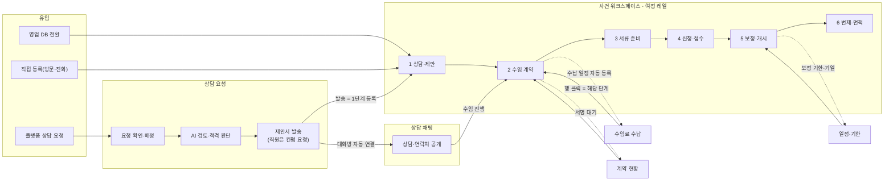

# 마이김변 변호사 어드민 UI·디자인 업그레이드 작업 기획서

- 작성일: 2026-09-30
- 대상: 변호사·직원이 쓰는 변호사 어드민 전체 화면(사이드바 메뉴 13개, 숨은 화면 2개, 사건 상세 6단계·서브탭 16개, 주요 모달, 전역 실무 퀵툴). 고객 사이트는 `docs/mykim_client_ui_upgrade_plan.md`에서 다루며, 두 기획서는 토큰과 공통 부품을 함께 씁니다.
- 기준 코드: 작업 사본(미커밋 변경 포함). 상담 채팅은 새로 분리된 `src/components/lawyer/chat/*` 기준으로 판단했습니다.
- 개정: 2026-09-30 다른 창에서 작업한 미배포 상담 채팅 개편과 실무 퀵툴 업그레이드의 검토 결과를 반영했습니다(10장, Phase R). 같은 날 9장 결정 11건과 착수 순서(7장)를 반영했습니다.
- 상태: 검토용 기획안입니다. 승인 전까지 코드는 수정하지 않았습니다.

---

## 0. 한눈에 보기

**결론**

1. 실무 기능은 이미 충분히 들어와 있습니다. 문제는 기능의 양이 아니라 **흐름과 배치**입니다. 상담 요청부터 면책까지 한 사건이 사이드바 메뉴 6곳, 상태 체계 5종, '고객 상세' 화면 5곳에 흩어져 있어 "이 사건에서 지금 할 일"이 한눈에 보이지 않습니다.
2. 디자인을 다듬기 전에 먼저 맞춰야 할 것이 있습니다.
   - **단계 판정 불일치**: 같은 사건의 진행 단계를 계산하는 식이 4곳에 따로 있고, 일부 진행률은 고정값입니다.
   - **확인 없이 바뀌는 상태**: 13단계 바 클릭, 목록의 빠른 상태 변경, 칸반 드래그가 게이트나 확인을 건너뛰고 의뢰인 알림까지 보냅니다.
   - **끊긴 절차**: 접수 후 사건번호, 개시결정을 기록할 입력란이 없어 5→6단계를 화면에서 정상적으로 넘길 수 없습니다.
   - **표시 규칙 불일치**: 같은 사건에서 헤더는 연락처를 가리고, 브리핑 카드는 실명과 전체 번호를 보여 줍니다.
3. 가장 복잡한 곳은 사건 상세입니다. 첫 화면 높이의 약 1/3이 내비게이션(프로필 배너·툴바·단계 카드)이고, 파이프라인 6단계와 서브탭 16개, 13단계 바가 한 화면에 공존합니다. 단계 본문 안에도 탭과 필터가 4~5층 더 있습니다.
4. 제안의 중심은 세 가지입니다.
   - **수임 여정 6단계로 통일**: 모든 화면이 같은 단계와 같은 '다음 할 일'을 보여 주고, 단계 완료는 확인 시트 한 곳에서만 일어납니다.
   - **사건 워크스페이스 재구성**: 단계 레일 1개 + 단계별 섹션 탭 2~4개 + 우측 컨텍스트 패널(의뢰인·소통·메모). 계약·수납·일정 화면은 여러 사건을 모아 보는 '작업 큐'로 두고, 모든 행이 해당 사건의 정확한 단계로 연결됩니다.
   - **조용한 업무 도구 톤의 디자인 시스템**: 라이트 캔버스, 네이비 단일 브랜드, 의미색 4종, 12px 하한, 이모지·그라데이션·페이지 안 다크 영역 제거.
5. 다른 창에서 작업한 **상담 채팅 개편과 실무 퀵툴 업그레이드는 아직 배포 전**입니다(10장).
   - 채팅 모듈은 이 기획의 방향과 같습니다. 흰 칩 + 상태색 점, 라벨이 있는 아이콘 버튼, 44px 터치 영역, focus-visible 패턴을 어드민 표준으로 넓히는 것을 권장합니다.
   - 퀵툴은 계산·도구 간 연동이 좋아졌지만 화면 톤(다크 메뉴·12px 미만 185곳)은 어드민 기준과 다르고, 사건과 연결되어 있지 않습니다.
   - 배포 전에 고칠 것이 있습니다. 비교 상담 메시지의 대상 변호사가 서버에 저장되지 않는 문제(보안), 메모 저장이 서버 행을 덮을 수 있는 경로, 변호사 메시지 전송 실패가 보이지 않는 문제, 채팅에서 고객관리로 갈 때 요청한 탭이 열리지 않는 문제, 퀵툴 창의 Esc·키보드·겹침 문제입니다. 이것을 **Phase R**에서 먼저 고치고, 운영 배포는 어드민 개편 Phase 1~2와 함께 합니다(결정 9). 다만 비교 상담 메시지 노출은 운영에도 있는 문제라 R-1만 따로 먼저 배포하는 것을 권장합니다(확인 필요).
6. 제안은 Phase R과 5단계(Phase 0~4)입니다. **Phase R(미배포 작업 마무리) → Phase 0(흐름 정합성) → Phase 1(셸·기반) → Phase 2(수임 여정 연결)** 순서를 권장합니다. 예상 규모는 전체 약 56~77 작업일(1인 기준 추정), 권장안(Phase R~2)은 약 32~45일입니다. Phase R만 따로 하면 약 4~6일입니다.
7. **착수는 고객 사이트 작업이 끝나 배포된 뒤**입니다. 두 작업이 같은 작업 사본에서 공용 파일을 함께 고치고 있어, 지금 시작하면 파일이 겹치고 고객 배포에 어드민 변경이 섞입니다(7장 착수 순서).

**핵심 수치**

| 항목 | 측정값 | 비고 |
|---|---|---|
| 점검 코드 | 196개 파일, 100,811줄 | `components/lawyer/*` + `LawyerRole.tsx` |
| 큰 파일 | CrmTab 5,740줄 · LawyerRole 5,604줄 · TasksScheduleTab 3,043줄 · ContractWizard 2,891줄 · RepaymentPlanEditor 2,621줄 · Stage2 2,235줄 | 화면 1개가 파일 1개에 몰린 구조 |
| 상태 체계 | 5종 | 상담 요청 12개, CRM 9개, 파이프라인 6단계, 13단계, 영업 리드 10개 |
| 단계 완료 판정식 | 4곳 | `pipelineGates.ts`, Stage1, Stage4, CrmTab 툴바(일부 고정값) |
| 계약 작성·편집 화면 | 4곳 | 수임 전환 모달, 전자계약 서브탭, 사건 2단계, 전자계약 메뉴(편집) |
| 분납 일정 생성 로직 | 5곳 | 위저드, 수임 전환 모달, 사건 2단계, 분납 등록 모달, 수임료 서브탭 |
| 같은 사람의 '상세' 화면 | 5곳 | 영업 리드 상세, 사건 상세, 채팅 우측 레일, 제안서 참고 패널, AI 분석 원본 정보 |
| 12px 미만 글자(코드) | 2,366곳 | 11px 1,275 · 10px 1,016 · 9px 68 · 8px 7 |
| 12px 미만 글자(화면) | 사건 상세 3단계 172개, 수임료 177개, 대시보드 58개(텍스트의 28%) | 1440×900 캡처 측정 |
| text-xs 실제 크기 | 12px | `--font-size-*` 재정의가 Tailwind v4에서 무시됨(고객 기획서와 같은 원인) |
| 하드코딩 색 | hex 564곳(그중 #1E3A5F 359곳), 보라·인디고·핑크 계열 1,520곳 | 브랜드 토큰과 같은 값을 직접 입력 |
| 장식 | 그라데이션 99곳, font-black 683곳, 이모지 약 920개, animate-pulse 62곳 | |
| 모달·접근성 | 오버레이(`fixed inset-0`) 92곳 중 role="dialog" 4곳, 클릭 가능한 div 60곳 | |
| 로딩 표현 | 스피너 23곳, 스켈레톤 사실상 없음 | |
| 네이티브 대화상자 | window.confirm 5곳, prompt 2곳 | 나머지는 DialogProvider 사용(양호) |
| 새 채팅 모듈(미배포) | 16개 파일 2,609줄, 12px 미만 0, 이모지 0, 그라데이션 0, aria-label 18, focus-visible 클래스 38 | 어드민 표준 후보(10.4) |
| 퀵툴 업그레이드(미배포) | 34개 파일 6,263줄, 12px 미만 185, 그라데이션 8, font-black 17, aria-label 37, focus-visible 클래스 4 | 계산은 개선, 화면 톤·사건 연결은 정리 필요(10.3) |

---

## 1. 점검 범위와 방법

- **범위**
  - 셸: `LawyerRole.tsx`(헤더·사이드바·모바일 하단 탭·전역 모달, 대시보드·빌링·설정 인라인 구현)
  - 사이드바 13개 메뉴: 종합 대시보드, 상담 채팅, 영업관리, 고객관리, 일정/할일, 전자 계약, 수임료 정산, AI 사건 분석, 고민상담 Q&A, 광고/빌링, 직원 관리, 마이김변 문의, 알림 및 설정
  - 숨은 화면 2개: 제안서 워크스페이스(`proposal-workspace`), 알림에서만 들어가는 `cases`(렌더 블록 없음)
  - 진입 화면: 로그인, 자격 심사 대기, 체험 모드 배너
  - 사건 상세: 파이프라인 6단계(`pipeline/*`), 서브탭 16개, 13단계 바, 사건 팩트시트, 고객 소통창
  - 주요 모달: 계약 위저드, 수임 전환, 서식 작성기, 보정센터, 사후관리, 영업 리드 전환 등
- **방법**
  1. 코드 리뷰: 셸, 사건 목록, 파이프라인, 수임 전 퍼널, 운영 화면 5개 영역으로 나눠 파일·라인 단위로 확인
  2. 화면 캡처: 로컬 개발 서버에 DEV 데모 계정으로 진입해 데스크톱 1440×900으로 촬영. Supabase·외부 호출과 모든 쓰기 요청을 차단하고 목업 데이터만 렌더링
  3. 자동 측정: 화면 분량(스크롤 높이 ÷ 뷰포트), 보이는 버튼·입력 수, 12px 미만 텍스트, 이모지 텍스트(부록 B)
  4. 규칙 대조: `.agents/AGENTS.md` 디자인 규칙 R1~R5
  5. 미배포 작업 검토: 다른 창의 작업 기록 2건(`docs/lawyer_chat_ui_upgrade_plan.md`, `docs/LAUNCH_READINESS_CHECKLIST.md` 2-2)과 코드를 대조하고 타입 검사를 다시 실행(10장)
- **한계**
  - 목업 데이터라 실제 사건·서류 수가 많으면 밀도는 더 높아집니다. 6단계는 목업 사건이 모두 개시 전이라 촬영하지 못해 코드로 판단했습니다.
  - 모바일(390px)은 코드 기준으로만 판단했습니다.
  - 대비·접근성 수치는 자동 측정 근사치입니다. WCAG 준수 여부는 보조기기 수동 테스트와 전문가 검토가 별도로 필요합니다.
  - 단계 완료 기준(예: 서류 승인률)과 법률 문구는 '제안'까지만 판단했습니다. 사무소 실무 기준과 법무 검토로 확정해야 합니다.
  - 상담 채팅과 퀵툴 독, `LawyerRole.tsx`는 다른 창에서 작업한 미커밋·미배포 코드라 줄 번호 대신 구역·함수 이름으로 표기했습니다. 두 작업의 실제 서버(Supabase) 연동 동작과 실기기 동작은 재현하지 않았습니다.

**화면 밀도 측정(1440×900, 본문 스크롤 영역 기준)**

| 화면 | 화면 분량 | 보이는 버튼 | 입력 | 12px 미만 텍스트 | 이모지 텍스트 |
|---|---|---|---|---|---|
| 종합 대시보드 | 2.5 | 23 | 0 | 58 | 8 |
| 고객관리 목록 / 신규 리드 보기 | 1.2 / 1.7 | 31 / 25 | 11 / 4 | 44 / 74 | 38 / 30 |
| 사건 상세 1단계 | 1.2 | 18 | 0 | 108 | 12 |
| 사건 상세 2단계 | 2.2 | 58 | 8 | 121 | 9 |
| 사건 상세 3단계 | 2.8 | 57 | 0 | 172 | 12 |
| 사건 상세 4단계 / 5단계 | 1.6 / 1.2 | 51 / 19 | 2 / 0 | 121 / 50 | 9 / 10 |
| 사건 상세 서브탭(종합 정보) | 2.2 | 48 | 1 | 99 | 29 |
| 전자 계약 / 수임료 정산 | 1.7 / 1.8 | 50 / 47 | 1 / 11 | 78 / 177 | 17 / 8 |
| 영업관리 / 일정·할일 | 1.0 / 1.0 | 28 / 21 | 2 / 0 | 39 / 0 | 10 / 4 |
| 알림 및 설정(프로필) | 2.4 | 18 | 23 | 48 | 12 |
| 상담 채팅(새 모듈) | 1.0 | 20 | 2 | 0 | 0 |

---

## 2. 먼저 해결해야 할 문제 TOP 12

| # | 문제 | 위치(근거) | 사용자 영향 | 확인 |
|---|---|---|---|---|
| 1 | 같은 사건의 단계·진행률이 화면마다 다름. 완료 판정식이 4곳에 따로 있고, 툴바의 5단계 진행률은 '소명서 6/7종·85%' 고정값. 3단계 완료 기준도 스텝바는 '업로드 3건 이상', 단계 화면은 '승인 80% + 검토 대기 0' | `pipelineGates.ts` computePipelineGates, `Stage1ConsultationView.tsx:82-83`, `Stage4FilingBundleView.tsx:71-80`, `CrmTab.tsx` 툴바 stageMeta(약 2779-2819) | 진행 상황을 믿을 수 없음 | 코드 |
| 2 | 확인·게이트 없이 상태가 바뀌는 경로 3개. 13단계 바 클릭(즉시 저장 + 의뢰인 알림), 목록 '⚡ 상태 즉시 변경'(확인·게이트·이탈 사유 모두 생략), 칸반 드래그(제안서 게이트만 확인). 계약 위저드는 단계 탭을 누르면 검증을 건너뜀 | `CrmTab.tsx` 13단계 onSelectStage(약 3413-3490)·빠른 실행(약 2046-2096)·`handleKanbanDrop`(1131-1199), `ContractWizard.tsx` 단계 탭 | 잘못된 알림 발송, 절차 누락 | 코드 |
| 3 | 절차를 화면에서 마칠 수 없음. 4단계 접수 후 사건번호 입력란이 없고, 5단계에는 개시결정을 기록할 곳이 없어 6단계 잠금이 풀리지 않음(13단계 바·상태 편집으로 우회). 6단계에는 면책·종결 동작이 없음 | `Stage4FilingBundleView.tsx`, `Stage5CorrectionCenterView.tsx`, `pipelineGates.ts` locked[6] | 수임 흐름 후반부가 끊김 | 코드·캡처 |
| 4 | 서류 진행 상태가 '이 브라우저'에만 저장됨. 다른 직원·기기에서는 다르게 보이고, 서브탭 '문서'와도 데이터 소스가 다름 | `Stage3DocumentsHubView.tsx:66-80`(localStorage) | 서류 누락·중복 요청 | 코드 |
| 5 | 연락처·실명 표시 규칙 불일치. 같은 사건에서 헤더는 '010-****-**** (미공개)'인데 종합 브리핑 카드와 4단계 화면은 실명·전체 번호를 표시. 공개 판정이 `status === 'contracted'` 하나만 봐서 서류 단계부터 다시 가려짐 | `LawyerRole.tsx` getDisplayPhoneNumber·getDisplayClientName, `CaseBriefingBanner`, Stage4 상단 | 개인정보 처리 혼선, 업무 불편 | 캡처·코드 |
| 6 | 계약·수임료 입력 경로 중복. 계약 화면 4곳, 분납 일정 로직 5곳. 위저드 저장 1번에 저장·CRM 동기화가 2번씩 실행되고, 계약을 다시 저장하면 CRM 쪽 납부 기록이 계약서 일정으로 덮어써질 수 있음 | `ContractWizard.tsx` handleSave(173-184)와 호출부 3곳, `crmService.ts` syncContractToCrm | 수임료·납부 기록 불일치 | 코드(덮어쓰기는 추론) |
| 7 | 사건 상세 첫 화면의 약 1/3(약 290px)이 내비게이션. 다크 프로필 배너 → 다크 툴바(칩·버튼 11개) → 6단계 카드 다음에야 본문이 시작되고, 본문 안에 다시 리본·카드·상태 필터·차수 탭·발급처 탭이 이어짐. 1440px에서 툴바 칩이 겹침 | `CrmTab.tsx` 2225-3080, `Stage3DocumentsHubView.tsx` 457-1191 | 할 일을 찾기 어려움 | 캡처 |
| 8 | 내비게이션 체계 3개 공존. 파이프라인 모드(6단계)와 서브탭 모드(16개)를 오가는 버튼이 없고, 인증서 금고·보정센터를 누르면 조용히 서브탭 모드로 바뀜. 서브탭 모드에서는 6단계 바에 현재 위치가 사라지고, '종합 정보' 탭 안에 13단계 바가 또 있음 | `CrmTab.tsx` pipelineViewMode(252), `WorkflowPipelineStepper.tsx` isActive | 현재 위치를 잃음 | 캡처·코드 |
| 9 | 상황과 맞지 않는 안내·버튼. 계약이 끝난 사건의 1단계가 '제안서 작성 및 발송하기'를 주 버튼으로 표시, 5단계에서 잠긴 6단계로 가는 초록 버튼이 활성, 2단계 확인창은 '체결 시 Stage 03 전환'이라 하지만 실제 전환 없음. '(Major)', 'Gate 1 … HUD' 같은 개발 용어 노출. 소통창 '처리 필요'에 모든 고객 공통 샘플 문구와 항상 켜진 빨간 점 | Stage1 상단, `Stage5CorrectionCenterView.tsx`(약 100-107), `Stage2ContractRetainerView.tsx:702`, `ClientCommunicationSidePanel.tsx`(약 405·458) | 잘못된 행동 유도 | 캡처·코드 |
| 10 | 사실과 다른 기본 표시. 팩트시트에 담당자가 없으면 '김사무장', 법원이 없으면 '서울회생법원', 생계비는 고정값. 목록의 사건 유형 배지는 저장값 대신 '소득 0 또는 채무 5억 초과면 파산'으로 추정 | `CrmTab.tsx:159-169`, 2155, 2444, 2451 | 잘못된 정보로 판단 | 코드 |
| 11 | 이동 후 맥락 유실. 대시보드·알림 클릭은 고객을 지정하지 않고 목록으로만 이동, 알림의 '사건' 링크는 빈 `cases` 화면, 딥링크 값을 비우지 않아 고객관리에 다시 들어오면 마지막 고객·탭이 다시 열림. 전자계약 'CRM 이동'은 고객을 열지 않는데 토스트는 '상세 화면으로 이동' | `LawyerRole.tsx` NotificationBell onNavigate·crmTarget* 상태, `ContractManagementTab.tsx` 643-656 | 매번 다시 찾아야 함 | 코드 |
| 12 | 화면을 가리는 요소와 네이티브 대화상자. 플로팅 '실무 퀵툴'이 모든 화면 우하단 버튼을 가리고, 어드민 모달과 같은 z-50이라 모달 위에도 떠서 눌림(미배포 채팅 개편은 버튼을 레일 헤더로 옮겨 피함). window.confirm 5곳·prompt 2곳(재통화 일시를 자유 입력), 토스트에 영문 값('connected') 노출 | `LegalQuickDock.tsx`·`quickdock/useDraggableDock.ts`, `leads/SalesLeadsTab.tsx` 155·508, `FeeSettlementTab.tsx` 421 | 버튼 누락, 오입력 | 캡처·코드 |

1~6번은 디자인 이전의 정합성 문제입니다. 화면을 새로 짜도 그대로 남기 때문에 Phase 0에서 먼저 처리하는 것을 권장합니다.

미배포 채팅·퀵툴 작업에서 찾은 배포 전 문제(비교 상담 대상 변호사 미저장, 메모 저장의 덮어쓰기 경로, 전송 실패 미표시 등)는 10장에 따로 정리했고, 이 표보다 먼저 Phase R에서 처리합니다.

---

## 3. 수임 진행 흐름: 진단과 재설계

요청하신 "수임 진행 순서가 부드럽게 이어지는 흐름"이 이 기획서의 중심입니다.

### 3.1 현재 흐름

| 순서 | 하는 일 | 지금 담당 화면 | 다음으로 넘어가는 방식 | 끊기는 지점 |
|---|---|---|---|---|
| 1 | 새 상담 요청 확인 | 고객관리 > '신규 리드' 보기(목록 뷰 토글 안) | 사용자가 찾아 들어감 | 대시보드 카드·KPI는 고객을 지정하지 않고 목록으로만 이동 |
| 2 | 사건 검토 | AI 사건 분석(별도 메뉴) | '맞춤 제안서 스튜디오' 버튼 | 고객관리 경로의 제안서에는 AI 분석 결과가 전달되지 않음(`aiAnalysis={undefined}`) |
| 3 | 제안서 작성·발송 | 제안서 워크스페이스(사이드바에 없는 전체 화면) | 발송하면 채팅으로 자동 이동 | 흐름 전체에서 유일한 자동 연결. 직원은 컨펌 요청 → 대표가 대시보드 위젯·알림에서 검토 |
| 4 | 상담 진행 | 상담 채팅 | 우측 레일 '정식 수임 전환'(미배포 개편에서 레일 헤더로 이동) | 이미 사건이 있어도 버튼이 보이고 누르면 오류 토스트. '고객관리에서 열기'는 요청한 탭 대신 파이프라인 화면으로 열림(10.2) |
| 5 | 수임 계약 | 수임 전환 모달(자체 3단계 폼) → 고객관리 '전자계약' 서브탭 | 체결하면 고객관리로 이동 | 같은 계약을 사건 2단계·전자계약 서브탭·전자계약 메뉴에서도 따로 다룸 |
| 6 | 서류 수집 | 사건 3단계 | 조건을 채우면 하단 버튼 | 상태가 브라우저에만 저장, 스텝바와 완료 기준이 다름 |
| 7 | 신청서·접수 | 사건 4단계 + 서식 작성기(모달) | '접수 완료 처리' | 사건번호 입력란 없음 |
| 8 | 보정·개시 | 사건 5단계 → 보정센터(서브탭으로 전환) | 항상 활성인 '6단계로 진행' 버튼 | 개시결정 기록 수단 없음 → 6단계 잠김 |
| 9 | 변제·면책 | 사건 6단계 → 사후관리 모달 | 없음 | 면책·종결 동작 없음, 개시결정 요약 카드는 서브탭에만 있음 |
| 별도 | 영업 DB → 고객 이전 | 영업관리 > 리드 전환 모달 | 토스트의 버튼으로만 이동 | 전환 후에도 영업관리에 머묾. 다시 입력할 항목이 많은데 '데이터 무손실 100% 이관 보장' 표기 |

### 3.2 상태 체계 5종

| 체계 | 값 | 쓰는 곳 | 문제 |
|---|---|---|---|
| 상담 요청 `ConsultStatus` | requested ~ discharged 12개 | 채팅, 대시보드, 제안서 | 채팅은 새 `consultStatus.ts`로 라벨이 통일됨(양호) |
| CRM `CrmStatus` | requested, consulting ~ cancelled 9개 | 고객관리 목록·칸반·팩트시트 | 'consulting'은 상담 요청 체계에 없음. 이모지 + 10색 |
| 파이프라인 6단계 | 상담·적격 검토 ~ 사후관리·면책 | 사건 상세 스텝바 | 파산 사건도 회생 용어를 씀(`isBankruptcy` 미사용) |
| 13단계 `thirteenStage` | 상담대기 ~ 종료 | '종합 정보' 서브탭 | 게이트 없음. 6단계와 경계가 한 칸씩 어긋남(예: '신청서 작성'이 3단계로 표시) |
| 영업 리드 `LeadStatus` | new ~ wrong_number 10개 | 영업관리 | 토스트·이력에 영문 값 노출 |

라벨도 체계마다 다릅니다. 같은 시점을 '수임 계약'(CRM·채팅), '계약·착수'(6단계), '계약'(13단계)으로 부르고, 다음 단계 버튼은 'Stage 02 (계약·착수)로 진행', 'Stage 3 (서류수집)로 진행', 'Stage 4 … 이동'처럼 표기가 섞여 있습니다.

### 3.3 목표 모델: 수임 여정 6단계 + 세부 절차

단계 수는 지금의 6개를 유지하고(코드 영향 최소), 이름과 경계를 실무 순서에 맞춥니다. 첫 응답 전의 새 요청은 '상담 요청'에서 다루고, 제안서를 보내거나 직접 등록하면 사건 관리 1단계에 올라갑니다. 13단계는 없애지 않고 4~6단계 안의 **세부 절차(마일스톤)** 로 내립니다.

| 단계 | 포함 상태(CRM / 상담 요청) | 세부 절차 | 완료 조건(제안) | 다음 할 일 예시 | 완료할 때 자동 준비 |
|---|---|---|---|---|---|
| 1 상담·제안 | requested·consulting / requested~counseling | 상담 대기, 상담 완료 | 제안서 발송, 의뢰인 연락처 공개(외부 유입은 면제), 적격 판단 기록 | 제안서 작성 · 의뢰인 응답 대기 · 전화 상담 기록 | 응답 대기 리마인드(48시간), 상담 요약 |
| 2 수임 계약 | contracted | 계약 | 계약 체결(전자서명 완료 또는 서면 체결 처리), 수임료 일정 등록 | 계약서 발송 · 서명 재요청 · 착수금 입금 확인 | 수납 일정 등록, 발급처별 서류 요청 묶음 초안 |
| 3 서류 준비 | document | 서류 준비 | 필수 서류 승인 기준 충족(사무소 설정, 기본 80%), 검토 대기 0, 부채증명서 수령 | 제출 서류 검토 n건 · 미제출 서류 요청 | 신청 서식 초안(수입지출·재산·채권자 목록 반영) |
| 4 신청·접수 | document → filed | 신청서 작성, 신청서 제출, 금지명령 | 필수 서식 검토 완료, 의뢰인 제출 동의, 접수일·사건번호 등록 | 서식 검토 n/8 · 제출 동의 요청 · 접수 정보 등록 | 법원 진행 추적, 금지명령 결정 대기 할 일 |
| 5 보정·개시 | filed | 금지명령, 보정기간, 개시결정 | 보정 제출 완료(있을 때), 개시결정 등록(결정일·가상계좌·1회차 납입일) | 보정서 제출 D-n · 개시결정 등록 | 보정 기한 일정·할 일(기존 불변기한 계산 재사용), 가상계좌 안내 |
| 6 변제·면책 | commenced·repaying·discharged | 채권자집회, 인가결정, 면책(예외: 기각·폐지) | 면책 결정 등록 → 사건 종결 | 적립금 미납 확인 · 집회 출석 안내 · 면책 신청 | 변제 회차 일정, 조건부 인가 소득 보고 리마인드 |

- 파산 사건은 같은 레일을 쓰되 4~6단계 이름을 '신청·접수 / 심문·선고 / 면책'으로 바꿉니다.
- CRM 'document' 상태가 서류 준비와 신청서 작성을 함께 담고 있어, 서류 완료 시점(`documentsCompletedAt`)을 기록해 3·4단계를 구분합니다.
- 모든 화면은 `getJourneyState(사건)` 하나에서 현재 단계, 단계별 상태(완료·진행·막힘·예정), 다음 할 일, 막힌 이유를 받습니다. 목록 배지·단계 레일·대시보드·칸반이 같은 값을 씁니다.

### 3.4 단계 전환 규칙

1. **단계마다 주 버튼은 하나입니다.** 사건 헤더 오른쪽의 '다음 할 일' 버튼이 유일한 주 버튼입니다. 단계 화면 하단의 다크 바와 상단 영역의 중복 버튼은 없앱니다.
2. **완료 조건을 먼저 보여 줍니다.** 단계 헤더에 조건 3~5개를 체크리스트로 표시하고, 채우지 못한 항목은 해당 섹션으로 바로 가는 링크를 겁니다.
3. **완료는 확인 시트 한 곳에서 합니다.** 조건을 모두 채우면 버튼이 '서류 준비 완료하고 다음 단계로'처럼 바뀝니다. 확인 시트에는 이번 단계 결과 요약, 의뢰인 알림 미리보기와 '보내기' 선택(기본 켜짐), 자동으로 만들 할 일·일정·수납 항목 목록(항목별 체크)을 보여 줍니다. 확정하면 다음 단계로 이동하고 5초간 '되돌리기'를 제공합니다.
4. **잠긴 단계는 막지 말고 설명합니다.** 레일에서 잠긴 단계를 누르면 경고창 대신 읽기 전용 미리보기와 '열리려면 필요한 것' 목록을 보여 줍니다.
5. **지난 단계는 요약으로 보여 줍니다.** 완료한 단계를 다시 열면 결과 요약(누가·언제·무엇을)이 먼저 나오고, 고칠 때만 '수정'을 누릅니다. 계약이 끝난 사건에 '제안서 작성' 버튼이 뜨는 문제가 없어집니다.
6. **예외는 명시적으로 처리합니다.** 기각·폐지, 의뢰인 취소, 단계 되돌리기는 '더보기 > 단계 조정'에서 사유를 입력해야 하고 활동 기록에 남습니다. 13단계 바·목록 빠른 변경·칸반 드래그로 상태를 바꾸는 경로는 없앱니다.
7. **기다리는 단계에도 할 일을 보여 줍니다.** 법원 결정을 기다릴 때는 주 버튼 대신 '접수 후 12일 · 금지명령 결정 대기'와 보조 동작('나의사건검색 확인')을 표시합니다.

### 3.5 목표 흐름



### 3.6 화면 사이 연결 규칙

- 이동 함수를 하나로 모읍니다: `openCase(사건ID, { 단계, 섹션 })`, `openRequest(요청ID)`, `openThread(요청ID)`. 대시보드·알림·전역 검색·작업 큐·채팅이 모두 이 함수만 씁니다.
- 위치를 URL에 남깁니다(예: `?view=cases&case=…&stage=documents&section=issuance`). 새로고침·뒤로가기·링크 공유 때 같은 화면으로 돌아옵니다. 지금은 탭 이름만 기록해서 뒤로가기로 제안서 화면에 오면 빈 화면이 됩니다.
- 딥링크 값은 한 번 쓰고 비웁니다. 빈 `cases` 화면은 `openCase`로 대체합니다.
- 작업 큐(계약 현황·수임료 수납·일정·기한)의 모든 행에 '사건 열기'를 두고, 해당 단계·섹션을 바로 엽니다. 반대로 사건 안에서는 '이 사건의 수납 일정'처럼 필터된 큐로 갈 수 있게 합니다.
- 영업 리드 전환 모달에는 '이관 항목 n개 / 상담에서 확인할 항목 m개'를 보여 주고, 비어 있는 필수 항목은 사건 1단계의 '확인 필요' 목록에 자동으로 넣습니다. 전환 뒤 기본 동작은 '사건 열기'이고, 리드는 '이관됨'(읽기 전용 + 사건 링크)으로 남깁니다.
- 채팅의 '정식 수임 전환'은 '수임 진행'으로 바꾸고, 계약서 작성은 사건 2단계에서만 합니다. 이미 사건이 진행 중이면 버튼이 '사건 열기'로 바뀝니다(버튼 전환은 Phase R-2에서 먼저 적용).

---

## 4. 화면 구조와 화면별 개편안

### 4.1 내비게이션

사이드바를 수임 여정 순서로 다시 묶습니다. 항목 수는 13개 그대로이고(마이김변 문의는 헤더로 옮기고 상담 요청을 새로 둠), 그룹 5개·그룹당 4개 이하입니다. 'AI 사건 분석'을 별도 메뉴로 두면서(결정 2) 상담 그룹이 5개가 되지 않도록 유입을 만드는 메뉴를 '영업·홍보' 그룹으로 나눴습니다.

| 그룹 | 새 메뉴 | 현재 메뉴 | 배지(행동이 필요한 수만) |
|---|---|---|---|
| 홈 | 오늘의 업무 | 종합 대시보드 | 없음 |
| 상담 | 상담 요청 | 고객관리 '신규 리드' 보기 | 첫 응답 전 요청 |
| 상담 | AI 사건 분석 | AI 사건 분석(유료) | 없음(미구독이면 잠금 표시) |
| 상담 | 상담 채팅 | 상담 채팅 | 답변 필요 |
| 사건 | 사건 관리 | 고객관리 | 내 담당 중 기한 임박 |
| 사건 | 일정·기한 | 일정 / 할일 | 3일 이내 기한 |
| 사건 | 계약 현황 | 전자 계약 | 서명 지연 |
| 사건 | 수임료 수납 | 수임료 정산 | 연체 |
| 영업·홍보 | 영업 DB | 영업관리 | 오늘 재통화·지연 |
| 영업·홍보 | 공개 Q&A | 고민상담 Q&A | 미답변 |
| 영업·홍보 | 광고·결제 | 광고 / 빌링 | 입금 대기 |
| 사무소 | 직원·권한 | 직원 관리 | 승인 대기 |
| 사무소 | 설정 | 알림 및 설정 | 없음 |

- 'AI 사건 분석'은 유료 기능을 드러내기 위해 별도 메뉴로 둡니다(결정 2). 같은 분석 결과를 상담 요청 미리보기와 사건 1단계 'AI 검토' 탭에서도 보여 주고, 미구독이면 잠금 안내와 이 메뉴로 가는 링크를 둡니다. 목록 행에서는 '제안서 작성'·'사건 열기'로 이어지고, 분석 결과는 제안서 편집기에 그대로 전달합니다. 사건검토 기준(RuleSet) 관리는 설정 > 업무 기준으로 갑니다.
- '마이김변 문의'와 플랫폼 공지는 헤더의 '도움말' 메뉴로 옮깁니다(화면은 유지).
- 배지는 두 가지만 씁니다: 일반(회색 숫자), 긴급(로즈). 상한은 99+로 통일하고, '고객관리 6'처럼 누적 건수는 배지로 쓰지 않습니다.
- 활성 메뉴는 전체 채움(브랜드색 + 그림자) 대신 옅은 배경과 왼쪽 표시선으로 차분하게 표시하고, '영업관리'만 파란색인 예외를 없앱니다.
- 같은 버튼을 14번 반복 작성한 구조(약 300줄)를 메뉴 설정 배열 하나로 바꾸고, 권한 검사를 사이드바·모바일 메뉴·화면 렌더에 똑같이 적용합니다. 지금은 직원 관리만 렌더 단계에서 검사합니다.

**헤더**

- 사무소명 · 전역 검색(가명·실명·사건번호·전화 끝 4자리, ⌘K) · 알림 · 도움말 · 프로필 메뉴(역할은 '대표 변호사 / 변호사 / 사무장' 한글 표기, 설정·로그아웃).
- 실무 퀵툴은 플로팅 독을 유지하고 기본 접힘(아이콘)으로 시작합니다(결정 6). 헤더에는 버튼을 두지 않고 Alt+Q로도 엽니다. 채팅 대화 헤더의 퀵툴 버튼(A7)은 선택 사항이며, 채팅 쪽 연결 지점은 미배포 개편에 준비되어 있습니다(10.4).
- 헤더(#1E293B)와 사이드바(#111827)를 브랜드 딥 네이비(#0F2440) 한 톤으로 맞춥니다.
- 검색 결과와 알림은 `openCase`로 사건의 해당 단계·섹션까지 엽니다.

**모바일**

- 하단 탭: 홈 · 상담 · 사건 · 일정 · 메뉴(톱니 대신 메뉴 아이콘), 탭별 배지. 메뉴 시트에 그룹 제목, 검색, 로그아웃을 넣습니다.
- 사건 워크스페이스는 채팅 개편과 같은 단일 패널 전환(단계 → 섹션 → 컨텍스트)과 하단 고정 '다음 할 일' 바를 씁니다.

### 4.2 화면별 진단과 개편 방향

| 화면 | 현재 구성 | 주요 문제 | 개편 방향 |
|---|---|---|---|
| 오늘의 업무(대시보드) | 8개 섹션: 컨펌 대기, 다크 'Command Center', KPI 6, 대기 의뢰인 3, Q&A·광고, 공지·일정, 퍼널·상담 유형, 유입·수임료·보정 D-day | 2.5화면, 카드 약 26개. 신규 상담 수가 3번 반복되고 전환율 계산식이 3개, 섹션마다 데이터 범위가 다름. 누르면 고객 지정 없이 목록으로 이동 | '오늘 처리할 일' 업무함 중심 1화면(4.4) |
| 상담 요청(신규) | 고객관리 안 '신규 리드' 토글 + AI 사건 분석 목록 + 숨은 제안서 화면 | 새 요청을 보려면 메뉴·토글을 두 번 거침. AI 결과가 제안서로 넘어가지 않음. 제안서 '사건 분석으로 돌아가기'가 실제로는 이전 탭으로 이동 | 요청 목록 + 미리보기(요약·AI 검토·제안서) 분할 화면(4.6) |
| 상담 채팅(미배포 개편) | 메시지함(검색·필터 4종) / 대화(자주 쓰는 답변 3개) / 우측 레일(요약·채무·재산·메모, 헤더에 수임 전환 또는 고객관리 열기) | 방향은 양호(10.2). 헤더 칩은 상담 상태만 보여 주고 사건 단계는 없음. 수임 전환이 별도 모달의 계약으로 이어지고, 변호사 메시지 전송 실패가 보이지 않음 | Phase R 수정 후 배포. 이후 헤더에 단계 칩·'사건 열기', '수임 진행' → 사건 2단계, 제안 요약 메시지를 카드형으로 |
| 영업 DB | 헤더 버튼 4개(보라·파랑), KPI 5 + 다크 통계 띠, 상태 탭 7(이모지), 아코디언 목록 ↔ 풀페이지 상세 | 상세로 가는 길이 3개이고 행 펼침이 '미니 상세' 역할. 전화 링크만 눌러도 '연결'로 기록, 재통화 일시는 prompt로 자유 입력 | 표 + 우측 상세 패널, 통화 결과 팝오버(일시 선택기), 상태 탭 5, 주 버튼 1개 |
| 사건 관리(목록) | 헤더 카드 + KPI 6(클릭 불가) + 그룹 탭 4·칩 3 + 검색·필터·도구 줄 + 9열 표 / 칸반 9열 | 첫 행 전 컨트롤 22개. '⚡ 상태 즉시 변경'이 게이트를 우회. '수임 계약'·'법원 접수' 배지가 같은 주황 계열. 모든 행에 '미배정' 경고 | 단계별 저장된 보기 + 필터 1줄 + 7열 표('다음 할 일' 열), 칸반은 조회용(4.5) |
| 사건 워크스페이스(상세) | 다크 배너 + 다크 툴바 + 6단계 카드 + (파이프라인 본문 또는 서브탭 16개) + 좌측 팩트시트 + 오버레이 소통창 | TOP 7·8. 단계 화면마다 헤더·버튼·색이 다름(1단계 다크 그라데이션, 4단계 다크 영역 + 보라 버튼, 5·6단계 흰 카드) | 라이트 헤더 + 단계 레일 + 단계 헤더 + 섹션 탭 + 컨텍스트 패널(4.3) |
| 일정·기한 | 서브탭 3(할일·캘린더·활동), 필터 3축 + 리스트/칸반, 모달 5개 | 항목이 사건과 배지로만 연결되어 이동 불가. 활동 기록이 직원 관리와 중복. 제목에 이모지 접두('⚖️ [기한]') | '기한·일정'과 '할 일' 두 보기, 모든 항목에 사건 링크, 보정 기한 자동 생성 |
| 계약 현황 | 'CONTRACT OPERATIONS & ADMIN' + '전자 계약 총괄 어드민 대시보드', KPI 4(다크 카드 포함), 골든타임 배너, 8열 원장 | 새 계약은 만들 수 없어 CRM으로 보냄. 연락처가 3줄로 줄바꿈, 행 버튼 5개. 지연 건을 KPI·배너·칩에서 3번 표시 | 보기 탭 + 요약 한 줄 + 6열 표, 행 주 버튼 1개, '사건 열기' |
| 수임료 수납 | '(Fee Settlement Hub)', KPI 4(색 4종), 필터 7, 11열 표 / 캘린더 | 표가 넓고 상태 색이 많음. 분납 등록이 사건 쪽과 중복. 덮어쓰기 경고가 window.confirm | 보기 탭 5 + 7열 표, 주 버튼 '입금 확인', 공통 분납 편집기, 연기 확인 시트 |
| AI 사건 분석 | 목록 표 + 상세(탭 6개 정의, 실제 렌더 2개) | 파이프라인과 연결되지 않음. 내용 없는 탭 4개 | 별도 메뉴 유지(결정 2). 내용 없는 탭 정리, 목록 행에서 '제안서 작성'·'사건 열기'로 연결, 결과를 상담 요청·사건 1단계 'AI 검토' 탭에도 표시 |
| 공개 Q&A | 필터·검색·아코디언·인라인 답변 폼 | 비교적 깔끔(12px 미만·이모지 0) | 유지. '상담 요청으로 이어짐' 표시와 빈 상태 버튼만 추가 |
| 광고·결제 | 서브탭 4, 다크 현황 영역, 네이비 그라데이션 상품 카드, 인라인 주문 모달 | 주문 모달에서 입금자명이 비어 있으면 아무 반응이 없음 | 탭 3(현황·주문 / 상품 / 세금계산서), 라이트 카드, 입력칸 아래 오류 |
| 직원·권한 | 통계 4(이모지) + 서브 메뉴 5 + 모달 3 + 상세 패널 | 서브 메뉴 순서와 화면 순서가 다름. 권한 부품(PermissionGate)이 쓰이지 않음 | 탭 4(구성원·초대·사건 배정·활동 로그), 역할별 권한표, 우측 서랍 상세 |
| 설정 | 카테고리 5(이모지, '보안'이 두 곳) × 세그먼트 → 최하위 9화면, 임베드 포함 약 5,300줄 | 원하는 설정을 찾기 어려움. 직인 관리 UI가 2벌. 프로필 편집기에 다크 헤더 | 좌측 메뉴 6개, 변경 시 하단 저장 바 |
| 마이김변 문의 | 작성 폼 + 내역 2열 | 사이드바 자리를 차지하는 저빈도 기능 | 헤더 '도움말'로 이동 |
| 로그인·심사 대기·체험 모드 | 소셜 로그인 카드(카카오·구글), 자격 심사 대기 화면, 체험 모드 상단 배너(주황 그라데이션, 깜빡이는 배지) | 로그인 카드는 깔끔함(유지). 체험 배너는 헤더 위에 쌓이는데 사이드바(상단 64px 고정)와 본문 높이 계산은 배너 높이를 반영하지 않아 겹치거나 잘릴 수 있음(코드 기준. 채팅 작업 기록에도 입력창 아래가 잘린다고 적혀 있음, 모든 탭 공통) | 헤더 아래 한 줄 안내 띠(앰버 50 배경, '심사 현황 보기'), 레이아웃 높이를 변수로 계산, 깜빡임 제거 |
| 실무 퀵툴(전역, 미배포 업그레이드) | 우하단 플로팅 독 → 도구 메뉴(검색·분류) → 떠 있는 창(탭), 도구 17개 + 알림톡 바로가기 | 계산·도구 간 연동은 개선(10.3). 다크 메뉴·창, 12px 미만 185곳, 우하단 버튼과 모달을 가림, Esc 한 번에 모든 도구 입력 삭제, 사건 값과 연결 없음 | 플로팅 유지·기본 접힘(결정 6), 본문 하단 여백과 모달이 열리면 숨김, 라이트 톤(결정 11), 사건 값 미리 채움·'사건에 반영'(10.4) |

### 4.3 사건 워크스페이스(가장 큰 변경)

**레이아웃(데스크톱 1280px 이상, 예시 데이터는 목업)**

```
[헤더] 사건 관리 › 희망58                                         ◀ 이전 사건 · 다음 사건 ▶
       희망58 | 개인회생 · 서울회생법원 · 2026개회○○○○ · 담당 김우진
       [채팅] [⋯]                                   [다음: 제출 서류 검토 4건]  ← 주 버튼 1개
[레일] ✓1 상담·제안 ─ ✓2 수임 계약 ─ ●3 서류 준비 ─ ○4 신청·접수 ─ ○5 보정·개시 ─ ◌6 변제·면책 | 문서함 · 기록
[본문]                                                          [컨텍스트 패널 320px]
  3단계 · 서류 준비                              진행 12/18        [의뢰인] [소통] [메모]
  ☑ 1차 서류 수령  ☐ 부채증명서 수령(D+3/7)  ☐ 필수 서류 승인 80%     총 채무 8,800만 · 월 소득 45만
  [발급 서류 18] [부채증명서] [진술서·수입지출]                     수임료 300만 · 2/4회 납부
  전체 18 · 검토 대기 4 · 보완 요청 1 · 미제출 6 · 승인 7   [묶음 요청]   확인 필요 2
  ▾ 주민센터·정부24 (5)                                            · 최근 1년 신규 대출
     주민등록초본(과거 주소 포함)          검토 대기    [검토]          · 미성년 자녀 부양 인정
     가족관계증명서(상세)                  승인                      [통화 기록] [알림톡]
  ▸ 국세청·홈택스 (3)   ▸ 직장·사업장 (3)   ▸ 금융·재산 (7)
```

- 다크 프로필 배너와 다크 툴바를 라이트 헤더 한 줄로 합칩니다. 헤더 정보는 4개(사건 유형·법원·사건번호·담당)까지만 두고, 나이·지역·소득 유형·특례는 컨텍스트 패널로 옮깁니다.
- 툴바 항목은 이렇게 옮깁니다.
  - 사건 팩트시트 → 컨텍스트 '의뢰인' 탭(기본 열림, 1280px 미만은 서랍)
  - 고객 소통창 → '소통' 탭(작업 화면을 가리지 않음)
  - 회생·파산 전환 → ⋯ '사건 유형 변경'(확인 필요)
  - 실무 서식 보관함(도구 10개) → 필요한 섹션 안에 해당 서식만, 전체 목록은 ⋯ '모든 서식'
  - 인증서 금고 → 3단계 발급 서류의 카드
  - 구글 드라이브 → 설정 > 알림·연동
- '이전/다음 사건' 버튼으로 목록 필터를 유지한 채 여러 사건을 이어서 처리할 수 있게 합니다.

**서브탭 16개 재배치**

| 현재 서브탭 | 새 위치 |
|---|---|
| 종합 정보 | 컨텍스트 '의뢰인' 탭 + 1단계 '상담 요약' 섹션 |
| 사건 요약문 | 1단계 '상담 요약' 섹션 |
| 상담 메모 · 내부 스레드 · 업무 지시 | 컨텍스트 '메모' 탭(메모 / 스레드 / 지시 필터) |
| 통화 및 문자 | 컨텍스트 '소통' 탭(통화·문자·알림톡·채팅 링크) |
| 타임라인 | 레일 오른쪽 '기록'(사건 전체 활동) |
| 문서 | 레일 오른쪽 '문서함'(3단계 발급 서류와 같은 데이터) |
| 수임료 · 전자계약 | 2단계 '수임료·분납' · '계약서' 섹션 |
| 인증서 금고 · 부채증명서 · 진술서 | 3단계 '발급 서류'(인증서 카드) · '부채증명서' · '진술서·수입지출' 섹션 |
| 변제계획안 / 개인파산·면책 | 4단계 '신청 서식' 섹션 |
| 보정 · 법원 | 5단계 '보정' · '법원 진행' 섹션 |
| (13단계 바) | 4~6단계 '법원 진행'의 세부 절차 타임라인(읽기 전용, 결정 등록으로만 갱신) |
| (개시결정 요약 카드) | 6단계 첫 섹션(가상계좌 편집 가능) |

파이프라인/서브탭 두 모드는 없앱니다. 어떤 기능이든 '단계 → 섹션' 또는 '컨텍스트 패널' 중 한 곳에만 둡니다.

**단계별 섹션 설계**

| 단계 | 섹션 탭 | 주 버튼 흐름 | 없애거나 옮길 것 |
|---|---|---|---|
| 1 상담·제안 | 상담 요약 · 적격 검토(4대 요건 계기판 + 지금은 쓰이지 않는 적격 체크리스트 연결) · AI 검토 · 제안서 | 제안서 작성 → 의뢰인 응답 대기(리마인드) → 전화 상담 기록 → 수임 계약 진행 | 상단 영역 4가지 변형, DEV 시뮬레이션 버튼(⋯ 안 DEV 표시로), 'Gate 1 … HUD' 문구 |
| 2 수임 계약 | 계약서(서식·특약·미리보기·발송/서면 체결) · 수임료·분납(공통 편집기) · 법원 비용(인지대·송달료) | 계약서 발송 → 서명 대기·재요청 → 다음: 서류 준비 | 중복된 '전자계약서 발송' 버튼, 하단 다크 총부담금 바(섹션 상단 요약 한 줄로), 계약 위저드 오버레이 |
| 3 서류 준비 | 발급 서류(발급처별 그룹 + 상태 칩 한 줄) · 부채증명서(대행 신청·D+n·수령) · 진술서·수입지출 | 제출 서류 검토 n건 → 미제출 서류 요청 → 다음: 신청·접수 | 릴레이 리본(완료 조건으로 흡수), 카드 3개 + 차수 탭 + 발급처 탭 중첩, 행당 버튼 2개(상태별 1개로) |
| 4 신청·접수 | 신청 서식(8대 서식 준비도 + 통합 작성기) · 부수 신청(금지·중지명령) · 검토·제출(변호사 검토, 의뢰인 제출 동의, 전자소송 묶음, 접수 정보 등록) | 서식 검토 n/8 → 제출 동의 요청 → 접수 정보 등록 | 다크 상단 영역과 보라 그라데이션 버튼, '13종' 제목과 칩 12개 불일치, 같은 무게의 버튼 2개 |
| 5 보정·개시 | 법원 진행(사건번호·기일·나의사건검색) · 보정(권고 등록 → 기한 자동 계산 → 7대 표 소명서 → 제출) · 결정 등록(금지명령·개시결정) | 보정서 제출 D-n → 개시결정 등록 → 다음: 변제·면책 | '종합 보정센터 열기 (Major)'(보정 섹션이 곧 보정센터), 항상 활성인 6단계 버튼, 클릭 가능한 div 7개 |
| 6 변제·면책 | 개시결정 요약(가상계좌 편집) · 채권자집회·인가 · 변제 관리(회차·미납 경고) · 면책 | 적립금 확인 → 집회 안내 → 면책 신청 → 사건 종결 | 사후관리 모달(섹션으로 펼침), 앱 알림만 등록하는 '가상계좌 안내' 버튼 |

계약 위저드는 6단계에서 3단계로 줄입니다(① 계약 정보: 위임인·사건 ② 비용: 수임료·실비·분납, 2단계 섹션과 같은 편집기 ③ 확인·서명: 약관 동의·서명·미리보기·발송). 단계 탭을 눌러 검증을 건너뛰지 못하게 하고, 확인창 문구는 실제 동작과 같게 씁니다.

### 4.4 오늘의 업무(대시보드)

```
[9월 30일 (수)]  오늘 처리할 일 12건                                   [내 담당 ▾ / 사무소 전체]
 [새 상담 요청 3]   [답변 필요 채팅 2]   [7일 내 기한 4]   [연체 수납 ₩2,100,000]   ← 누르면 필터된 큐
 오늘 처리할 일                                              이번 주 일정
 ▾ 기한 지남 (2)                                             10/2 14:00 채권자집회 · 청년31
    보정서 제출 · 햇살34 · 5단계        D+1   [보정 열기]       10/4 보정 기한 · 햇살34
    착수금 미납 · 다시한번44 · 2단계     D+3   [수납 열기]
 ▾ 오늘 (6)                                                  제안서 컨펌 요청(대표 변호사)
    새 상담 요청 응답 · 희망찾기412      12시간 [검토]          김직원 · 청년재기771  [검토]
    서류 검토 4건 · 희망58 · 3단계              [검토]
 ▸ 이번 주 (4)
 ▸ 사무소 현황(접힘): 단계별 사건 수 · 수임 전환 퍼널 · 수납 현황 · 유입 채널
```

- 업무함은 상담 요청 응답, 채팅 답변, 서류 검토, 서명 지연, 보정·접수 기한, 적립금 미납, 직원 승인, 제안서 컨펌을 한 목록으로 합치고, 모든 행이 `openCase`로 해당 단계·섹션을 엽니다.
- 핵심 수치 4개는 누르면 해당 큐의 필터된 화면으로 이동합니다.
- 없애는 것: 다크 'Command Center' 카드, 반복 지표, 광고 현황 카드(광고·결제로), 공지(헤더 도움말로), 상담 유형 상위 3개(사무소 현황 안으로).
- 지표 정의를 하나로 맞춥니다. 예: 전환율 = 기간 내 계약 체결 수 ÷ 제안서 발송 수. 모든 위젯이 같은 범위(내 담당 / 사무소 전체)를 씁니다.

### 4.5 사건 관리(목록)

- 헤더: 제목 '사건 관리' + 주 버튼 '사건 등록'(그라데이션 제거) + ⋯(가져오기·내보내기·대량 알림·휴지통·목록 설정).
- 누를 수 없는 KPI 6개 → 단계별 '저장된 보기' 탭: 전체 · 상담·제안 · 수임 계약 · 서류 준비 · 신청·접수 · 보정·개시 · 변제·면책 · 종결(카운트 포함). 빠른 필터 칩: 내 담당 · 미배정 · 기한 임박 · 중요.
- 검색·필터는 한 줄로: 검색 + 담당자 + 기간 + '필터'(유입 채널·사건 유형·페이지 크기). 정렬은 표 머리글에서 합니다.
- 표 9열 → 7열: 의뢰인(가명·사건 유형) · 단계(흰 칩 + 점, '3/6') · 다음 할 일(문구 + 기한) · 채무/소득 · 담당 · 최근 활동 · ⋯(채팅 열기·담당 변경·중요·삭제). 상태 변경은 목록에서 하지 않습니다.
- 사건 유형은 저장된 값만 표시하고, 비어 있으면 '미지정'으로 둡니다.
- 칸반은 6단계 열의 조회용 보드로 바꾸고 카드에 '다음 할 일'을 표시합니다(드래그 변경 여부는 9장 결정 사항).
- 빈 상태(아이콘·설명·'필터 초기화'/'사건 등록')와 표 스켈레톤을 넣습니다.

### 4.6 상담 요청(새 화면)

- 왼쪽 목록: 가명 · 요청 유형(지명/오픈) · 채무/월소득/재산 · 위험 태그 2개 + '+n' · 접수 후 경과 시간 · 상태(신규·검토 중·제안 발송·응답 대기). 필터: 신규 · 검토 중 · 제안 발송 · 참여 마감 임박.
- 오른쪽 미리보기 탭 3개: 요약(사연·재무·확인 필요 사항) / AI 검토(유료 잠금 안내 포함) / 제안서(작성·미리보기·발송 또는 컨펌 요청).
- 주 버튼은 상태에 따라 하나: 검토 시작 → 제안서 작성 → 발송(변호사) 또는 컨펌 요청(직원) → 채팅 열기.
- AI 검토 결과가 제안서 편집기에 그대로 들어갑니다. 직원의 컨펌 요청은 요청 상세의 '컨펌 대기' 배지와 대표 변호사의 업무함 항목으로 이어지고, 같은 제안서 탭이 검토 모드로 열립니다.
- '관심 없음'은 사유와 함께 숨기고, '숨긴 요청'에서 되살릴 수 있게 합니다.

### 4.7 작업 큐와 사무소 화면

- **계약 현황**: 계약 작성은 사건 2단계에서만 합니다. 이 화면은 보기 탭(서명 대기 · 서명 지연 24시간 이상 · 작성 중 · 체결 · 취소)과 요약 한 줄(이달 체결 n건 · 체결 수임료 · 서명 대기 n건)로 구성합니다. 표는 의뢰인(연락처 한 줄) · 사건 단계 · 수임료(분납 회차) · 서명 진행 막대(0/5) · 상태 · ⋯ 6열이고, 행 주 버튼은 상태별로 하나(재요청 / 열람 / PDF)입니다. '재촉 발송'은 알림톡 연동 시 '발송', 미연동 시 '문구 복사'로 이름을 나눕니다. 문서함·신청서류 설정은 설정 > 업무 기준으로 옮깁니다.
- **수임료 수납**: 보기 탭 5개(연체 · 이번 주 예정 · 집중 관리(연기 2회 이상) · 진행 중 · 완납). 요약 4칸은 같은 스타일로 두고 연체 금액만 로즈로 강조합니다. 표는 의뢰인·사건 · 약정/수납 진행 막대 · 다음 납부(일자·금액·D-day) · 상태 · 연기 횟수 · ⋯ 7열, 주 버튼은 '입금 확인'입니다. 분납 일정 등록은 사건 2단계와 같은 편집기를 시트로 엽니다.
- **일정·기한**: '기한·일정'(법원 기일·보정 기한·집회·납입일·상담 약속을 한 타임라인으로, 리스트/캘린더 전환)과 '할 일'(내 담당·지시함·사무소 전체) 두 보기로 줄입니다. 활동 기록은 직원·권한 > 활동 로그로 합칩니다. 필터는 한 줄(범위 + 유형 칩 + 상태)이고, 모든 항목에 '사건 열기'가 있습니다.
- **영업 DB**: 아코디언 대신 표 + 우측 상세 패널. 행의 '통화 결과' 버튼 하나로 부재 · 재통화 예약(날짜·시간 선택) · 상담 성공 · 거절 · 결번을 기록하고, 전화 링크를 누른 것만으로 '연결'을 기록하지 않습니다. 상태 탭은 신규 · 재통화 예정 · 부재 · 상담 중 · 이관 완료 5개입니다('오늘 예약'은 실제 조건에 맞게 '재통화 예정'). 상세의 12열 입력 폼은 접이식 4개 구역(기본 · 소득·가족 · 주거 · 채무·재산)으로 나눕니다.
- **직원·권한**: 탭 4개(구성원 · 초대 · 사건 배정 · 활동 로그). 승인 대기는 구성원 탭 상단 배너로 보여 주고, 역할별 권한표(메뉴·동작)를 추가하며, 상세는 우측 서랍으로 엽니다.
- **설정**: 좌측 메뉴 6개로 다시 묶습니다. 프로필 · 브랜딩(직인·로고, 두 벌인 직인 관리 UI를 하나로) · 상담 스타일(AI) · 알림·연동(알림톡·텔레그램·캘린더·드라이브) · 업무 기준(회생·파산 산정표, 사건검토 기준, 신청서류·계약서 서식) · 보안·데이터(기기 세션·백업). 변경이 생기면 하단 고정 저장 바를 띄웁니다.
- **광고·결제**: 탭 3개(현황·주문 / 상품 / 세금계산서). 다크 현황 영역과 그라데이션 상품 헤더를 라이트 카드로 바꾸고, 주문 모달의 필수값 누락은 입력칸 아래 오류로 알립니다.
- **공통 도구**: 실무 퀵툴은 플로팅 독(기본 접힘 아이콘)과 단축키(Alt+Q)로 엽니다(결정 6). 본문과 하단 고정 바에는 독 크기만큼 여백을 두고, 모달·시트가 열리면 독을 숨깁니다. 현재 사건의 채무·소득·채권자 수를 계산기에 미리 채우고, 사건을 바꾸면 도구 간 공유값을 비우며, 결과는 '사건에 반영'·'할 일 등록'으로 사건에 남깁니다(10.4). 모달 안의 모달(알림톡 발송 → 템플릿 등록)은 한 시트 안의 단계로 바꾸고, 서식 작성기처럼 큰 작업은 뒤로가기로 닫히는 전체 화면 '작업 모드'로 엽니다.

---

## 5. 디자인 시스템(어드민 적용분)

토큰과 기본 부품(Modal/Sheet, Skeleton·EmptyState·ErrorCard, Button, FormField, MoneyInput)은 고객 사이트 기획서 Phase 1과 같은 것을 씁니다. 여기서는 어드민에만 필요한 규칙과 부품을 정합니다.

### 5.1 방향: 조용한 업무 도구

- 라이트 캔버스(#F8FAFC) 위에 흰 패널을 두고, 구역은 선과 여백으로 나눕니다. 그림자는 떠 있는 층(메뉴·시트·모달)에만 씁니다.
- 색은 신호로만 씁니다. 브랜드 네이비는 주 버튼과 현재 위치에만, 의미색은 상태에만 씁니다. 장식용 색·그라데이션·페이지 안 다크 영역(대시보드 Command Center, 4단계 상단, 빌링 현황, 프로필 편집기 헤더, 계약 KPI 첫 카드)은 없앱니다.
- 정보 밀도는 높게, 장식은 낮게 둡니다. 표와 목록을 중심으로 숫자는 오른쪽 정렬하고 단위를 통일합니다.

### 5.2 토큰

| 구분 | 규칙 |
|---|---|
| 표면 | canvas #F8FAFC · panel #FFFFFF · subtle #F1F5F9 · border #E2E8F0 · border-strong #CBD5E1 |
| 브랜드 | #1E3A5F(주 버튼·활성) · hover #163152 · tint #EEF4FA · deep #0F2440(헤더·사이드바 전용). `bg-[#1E3A5F]`처럼 직접 입력한 359곳은 토큰으로 치환 |
| 글자 | #0F172A 본문 · #334155 보조 · #64748B 설명(흰 배경 대비 약 4.8:1). slate-400(#94A3B8)은 글자에 쓰지 않음 |
| 의미색 | 완료 emerald-700 · 주의 amber-700 · 위험 rose-600 · 정보 blue-700, 배경은 각 50 단계. 보라·인디고·핑크는 쓰지 않음(틸은 '면책 확정' 점 색에만) |
| 글자 크기 | 12(배지·캡션 최소) · 13(보조) · 14(본문·표) · 16(섹션 제목) · 18(페이지 제목) · 20/24(핵심 수치). `--text-*` 이름으로 재정의하고 8~11px 임의값 2,366곳 제거 |
| 굵기 | 400 본문 · 500 라벨 · 600 제목·버튼 · 700 핵심 수치. font-black(900) 683곳은 700 이하로 |
| 숫자 | tabular-nums, 금액 오른쪽 정렬, 한 화면 안에서 '만원' 또는 '원' 중 하나로 통일. 고정폭 글꼴은 사건번호·계좌번호에만 |
| 모서리 | 페이지·모달 24px(3xl) · 섹션 16px(2xl) · 입력·버튼 12px(xl) · 배지 8px(lg) — `AGENTS.md` R5 |
| 깊이 | 기본은 없음 또는 xs · 메뉴·시트 md · 모달 lg. 색 그림자(shadow-blue-500/20 등) 금지 |
| 아이콘 | lucide 한 세트, 16/20px. UI 라벨·상태·탭·필터의 이모지(약 920개) 제거. 의뢰인에게 가는 메시지 본문은 별도 정책으로 판단 |
| 모션 | 상태 전환 150~200ms. 무한 pulse(62곳)는 실제 실시간 신호에만 남기고 reduced-motion에 대응 |
| z-index | 고객 기획서와 같은 스케일(콘텐츠 < 사이드바·헤더 < 드롭다운·플로팅 도구(퀵툴) < 시트 < 모달 < 토스트). 지금은 오버레이 z 값이 z-50(39곳)·z-[9999](38곳)·z-[10000](5곳) 등으로 섞여 있고 퀵툴도 z-50 |

### 5.3 상태 표현

- 모든 상태 칩은 새 채팅 모듈의 `ConsultStatusChip` 방식(흰 칩 + 상태색 점 + 한국어 라벨)으로 통일합니다. `constants/consultStatus.ts`를 넓혀 여정 단계·계약·서류·수납 상태를 한 파일(예: `constants/statusMeta.ts`)에서 관리합니다.
- 단계는 색이 아니라 번호·이름·진행 상태로 구분합니다. 점 색은 진행 상태만 뜻합니다: 진행 중 브랜드 · 대기 회색 · 완료 초록 · 막힘 로즈 · 주의 앰버.
- 색만으로 구분하지 않습니다(점 + 글자, 필요하면 아이콘).
- 진행률은 실제 데이터로만 표시하고, 계산할 수 없으면 표시하지 않습니다.

### 5.4 어드민 공통 부품

| 부품 | 용도 | 대체되는 것 |
|---|---|---|
| AdminPageHeader | 제목 · 한 줄 설명 · 주 버튼 1개 · ⋯ | 화면마다 다른 헤더 카드, 영문 머리말 |
| ViewTabs | 저장된 보기 + 카운트 | 그룹 탭·KPI 필터·상태 칩 혼용 |
| FilterBar | 검색 + 필터 칩 + 고급 필터 팝오버 | 2단 툴바, 상세 필터 패널 |
| DataTable | 정렬·선택·행 주 버튼·⋯·스켈레톤·빈 상태·밀도 2단(행 48/40px) | 목록마다 다른 표·카드 |
| StatusChip | 5.3 규칙 | 상태별 색 배지 10색, 이모지 |
| MetricTile | 요약 수치(누르면 필터 적용) | 누를 수 없는 KPI 카드 |
| JourneyRail | 6단계 · 상태 · 잠김 미리보기 · 방향키 이동 | 6단계 카드, 13단계 바, 칸반 9열 |
| StageHeader | 단계명 · 완료 조건 체크리스트 · 진행 | 단계마다 다른 상단 영역 |
| SectionTabs | 단계 안 기능 구분(2~4개) | 차수 탭·발급처 탭 중첩 |
| ContextPanel | 의뢰인 · 소통 · 메모(인라인·서랍·한 화면 3형태), 채팅 `ClientContextRail` 패턴 확장 | 팩트시트, 소통창 오버레이, 5곳의 상세 |
| ConfirmSheet | 단계 완료·예외 처리(요약 · 알림 미리보기 · 자동 생성 항목) | 단계별 확인창·경고창 |
| WorkQueueItem | 업무함 행(유형 · 고객 · 할 일 · 기한 · 바로 처리) | 대시보드 카드 약 26개 |
| FeeScheduleEditor | 착수금·분납 일정 편집(계약·수납 공용) | 분납 로직 5곳 |
| MaskedName · MaskedPhone · Money | 공개 규칙에 따른 이름·번호 표시, 금액 표기 | 화면별 마스킹, 금액 표기 함수 5벌 |
| IconButton | 라벨·활성 상태가 있는 아이콘 버튼(44px 터치 영역) | 라벨 없는 아이콘 버튼 |
| CopyButton · copyText | 복사와 결과 안내(실패하면 대체 방식으로 다시 시도, 그래도 실패하면 오류 안내) | `navigator.clipboard.writeText` 직접 호출 61곳 |

채팅·퀵툴 모듈에 이미 있는 부품을 출발점으로 씁니다(10.4). StatusChip ← `ConsultStatusChip`, ContextPanel ← 채팅 레일의 `RailSection`·`DataRow`·`DefinitionGrid`, IconButton ← 채팅 `IconButton`, MoneyInput ← 퀵툴 `ui/MoneyInput`, CopyButton ← 퀵툴 `clipboard.ts`·`ui/CopyButton`.

### 5.5 용어 사전(1차)

| 현재 | 변경 |
|---|---|
| 종합 대시보드 / 회생·파산 법원사건 지휘 본부 / Command Center | 오늘의 업무 |
| 고객관리 / CRM / 상담 신청 고객 통합 관리 CRM | 사건 관리 |
| 13단계 사건 파이프라인 · Stage 0N 목표 | n단계 + 단계 이름(예: 3단계 서류 준비) |
| 정식 수임사건 전환 / 수임 전환 / 수임(계약) 전환 | 수임 진행(채팅) · 수임 계약(단계) |
| 전자 계약 총괄 어드민 대시보드 / CONTRACT OPERATIONS & ADMIN | 계약 현황 |
| 골든타임 미체결 리스크 · 골든타임지체 | 서명 지연 |
| 수임료 정산 관리 (Fee Settlement Hub) | 수임료 수납 |
| 종합 보정센터 열기 (Major) | 보정 |
| Gate 2 통과 완료 | 계약 체결 완료 |
| 데이터 무손실 100% 이관 보장 | 이관 항목 n개 · 확인 필요 m개 |
| LAWYER / OWNER(헤더 역할) | 변호사 / 대표 변호사 |
| 'connected' 등 영문 상태값 | '통화 연결' 등 한국어 라벨 |

보존 용어(스텔스 가명, 스텔스 보증, 100% 익명)와 `Disclaimers.tsx`의 안내 문구는 그대로 둡니다.

---

## 6. 작업 계획

규모 표기: S = 반나절 이내, M = 1~2일, L = 3일 이상

### Phase R. 미배포 작업 마무리·배포 (약 4~6일)

목표: 상담 채팅 개편과 실무 퀵툴 업그레이드에서 10장에서 찾은 보안·데이터 보호·화면 연결·키보드 문제를 고칩니다. 새 기능은 넣지 않습니다. 운영 배포는 어드민 개편 Phase 1~2와 함께 합니다(결정 9). 고객 사이트 배포가 끝난 뒤 어드민 브랜치에서 시작합니다(7장 착수 순서).

| ID | 작업 | 주요 파일 | 규모 |
|---|---|---|---|
| R-1 | (보안) 비교 상담 대상 변호사 서버 저장: 컬럼 추가 마이그레이션, 저장·불러오기 매핑, 조회 정책(RLS) 검토. 대상 정보가 없는 기존 의뢰인 메시지는 참여 변호사가 1명일 때만 표시(결정 10, 의뢰인 화면과 같은 규칙). 운영에도 있는 문제라 이 항목만 먼저 배포하는 것을 권장(확인 필요). 운영 DB를 바꾸므로 백업·되돌리기 스크립트를 준비하고 별도 승인 후 적용 | `services/consultService.ts`, `supabase/migrations/*`, `App.tsx`, `chat/chatSelectors.ts` | M |
| R-2 | 채팅 → 고객관리 연결: 요청한 서브탭으로 열기, 딥링크 값 한 번 쓰고 비우기, 사건이 있으면 '사건 열기', 요청 ID 기준 확인, 대화를 바꾸면 ⋯ 메뉴 닫기 | `CrmTab.tsx`, `LawyerRole.tsx`(onOpenCrm·handleConvertToCase), `chat/ClientContextRail.tsx`, `chat/LawyerChatWorkspace.tsx` | S~M |
| R-3 | 변호사 메시지 전송 결과: 실패 표시·다시 보내기·입력 복원(의뢰인 쪽 전송 상태 구현 재사용) | `LawyerRole.tsx`, `App.tsx`, `chat/ChatTimeline.tsx`, `chat/ChatComposer.tsx` | S~M |
| R-4 | 메모 저장 보호: 서버 불러오기가 실패하면 저장하지 않고 오류 표시(빈 기본값이나 오래된 브라우저 저장본으로 서버 행을 덮지 않게) | `chat/LawyerChatWorkspace.tsx`(saveMemo), `services/crmService.ts` | S |
| R-5 | 퀵툴 수정: Esc는 창 접기, 드래그 후 키보드로 열기, 모달이 열리면 독 숨김, 압류금지 도구가 공유값을 직접 읽도록, 지운 핀 이미지 캐시 제거, 배지 수 | `quickdock/FloatingToolWindow.tsx`, `quickdock/useDraggableDock.ts`, `LegalQuickDock.tsx`, `quickdock/tools/*` | S~M |
| R-6 | 수동 검증(10.5): 실제 서버 저장, 계정 2개로 비교 상담, 실기기 한글 입력, 클립보드 권한 거부, 키보드·스크린리더 | 10.5 확인 목록 | S |
| R-7 | 어드민 브랜치 준비(고객 배포 직전, Phase R 시작 전): 채팅·퀵툴 변경을 `feat/lawyer-admin-ui` 브랜치에 작업별로 나눠 커밋(채팅 / 퀵툴)해 작업 폴더에서 빼 둠(7장 착수 순서 2). 운영 배포는 Phase 2 완료 후 '배포해' 지시로 | Git 브랜치·커밋 | S |

완료 기준

- 10.2·10.3 표에서 편입이 R인 항목 모두 해결, tsc 오류 기준선(229건) 유지, build 통과
- 비교 상담에서 다른 변호사 대상 메시지가 서버에서 다시 불러온 뒤에도 보이지 않음(계정 2개로 확인)
- 채팅의 고객관리 링크가 지정한 탭을 열고, 이미 사건이 있으면 '사건 열기'가 보임
- 브랜치에서 채팅 전송·메모 저장·퀵툴 주요 도구 동작 확인(운영 배포는 Phase 2 이후)

### Phase 0. 흐름 정합성·신뢰 (약 7~10일)

목표: 화면을 새로 짜기 전에 단계·상태·표시 규칙을 하나로 맞춥니다.

| ID | 작업 | 주요 파일 | 규모 |
|---|---|---|---|
| 0-1 | 단계 판정 단일화. `getJourneyState()`를 만들고 스텝바·단계 화면·툴바·목록 배지·칸반이 모두 사용. 고정 진행률 제거 | `pipeline/pipelineGates.ts`, `CrmTab.tsx`, Stage1·4 | M |
| 0-2 | 상태 변경 경로 정리. 13단계 바 클릭 변경과 목록 빠른 변경 제거, 칸반 드래그는 확인 시트 + 게이트, 의뢰인 알림은 확인 후 발송 | `CrmTab.tsx`, `pipeline/LegalFlowThirteenStepper.tsx` | M |
| 0-3 | 빠진 입력 추가. 접수 정보(접수일·사건번호·법원), 개시결정 등록(결정일·가상계좌·1회차), 면책·종결과 기각·폐지 처리 | Stage4·5·6, `pipeline/DecisionSummaryCard.tsx` | M |
| 0-4 | 서류 상태 서버 저장. 3단계 localStorage → crmExt 저장, '문서'와 데이터 소스 통합, 기존 브라우저 데이터 이관 | `Stage3DocumentsHubView.tsx`, `services/crmService.ts` | M |
| 0-5 | 표시 규칙 단일화. 공개 판정(계약 이후 전 단계 + 연락처 공개)을 한 함수로 만들고 브리핑 카드·4단계·채팅(전화번호의 '****'로 가명 여부를 추정하는 `isPseudonymous`) 등 모든 이름·번호 표시가 이 함수를 사용 | `LawyerRole.tsx`(getDisplay*), `leads/CaseBriefingBanner.tsx`, Stage4, `chat/LawyerChatWorkspace.tsx` | S~M |
| 0-6 | 안내·버튼 수정. 지난 단계 요약, 잠긴 단계 버튼 비활성 + 사유, 2단계 확인창 문구, 개발 용어, 소통창 고정 샘플·항상 켜진 점 | `pipeline/*` | S |
| 0-7 | 가짜 기본값 제거. '김사무장'·'서울회생법원'·생계비 고정값·사건 유형 추정을 '미입력'으로 | `CrmTab.tsx` | S |
| 0-8 | 이동 함수·딥링크. `openCase/openRequest/openThread`, 대시보드·알림·검색·계약 'CRM 이동'이 사건을 지정, 빈 `cases` 제거, 딥링크 값 초기화. R-2의 임시 수정을 이 함수로 대체 | `LawyerRole.tsx`, `ContractManagementTab.tsx`, `NotificationBell.tsx` | M |
| 0-9 | 네이티브 대화상자 7곳 → DialogProvider·일시 선택기, 토스트 영문 값 → 한국어 | `leads/SalesLeadsTab.tsx`, `leads/CaseDetailAiSummary.tsx`, `FeeSettlementTab.tsx` | S |
| 0-10 | 계약 저장 1회화와 납부 기록 보존(계약을 다시 저장해도 납부 완료 회차 유지) | `ContractWizard.tsx`와 호출부 3곳, `services/crmService.ts` | M |
| 0-11 | 고객관리 저장 충돌 방지. 불러오기 실패를 호출부에 알리고(조용한 브라우저 저장본 대체 제거), 메모·서류 상태 등은 필드 단위로 저장하며 수정 시각을 비교해 다른 직원의 변경을 덮지 않음 | `services/crmService.ts`, `chat/LawyerChatWorkspace.tsx`, `CrmTab.tsx` | M |
| 0-12 | 법원 비용 기본 조합 통일. 사건의 신청 조합(금지명령·전자소송)을 사건 값 하나로 두고 전자계약·사건 2단계가 같은 값으로 계산(퀵툴은 사건에서 열 때 이 값을 기본값으로, 2-9), 2단계 문구를 계산식에서 생성(10.4) | `services/court/courtFees.ts`, `services/contractService.ts`, `pipeline/Stage2ContractRetainerView.tsx` | S |

완료 기준

- 한 사건의 단계·진행률이 목록·상세·대시보드에서 같게 표시됨
- 확인 없이 상태나 의뢰인 알림이 바뀌는 경로 0건
- 1단계부터 면책·종결까지 화면 동작만으로 진행 가능
- 이름·번호 표시가 한 함수에서만 결정됨(grep으로 확인)
- 같은 사건의 법원 비용이 전자계약과 2단계에서 같게 표시됨

### Phase 1. 셸·디자인 기반 (약 8~11일, 고객 사이트 Phase 1 부품을 먼저 만들면 6~8일)

| ID | 작업 | 주요 파일 | 규모 |
|---|---|---|---|
| 1-1 | 토큰(색·z-index 규칙은 고객 기획서 1-1과 공통. 고객 사이트는 글자 크기를 `.client-scale` 범위로 따로 두었으므로 어드민도 `.admin-scale` 범위로 12px 하한 스케일을 둠) + 어드민 규칙: 헤더·사이드바 단일 네이비, 다크 영역·그라데이션 금지 lint | `index.css` | S |
| 1-2 | 사이드바를 메뉴 설정 배열로, 새 그룹(홈·상담·사건·영업·홍보·사무소), 배지 2종 규칙, 권한 검사를 렌더에도 적용, 체험 배너 높이를 반영한 레이아웃 높이 계산(채팅 입력창 잘림 해소) | `LawyerRole.tsx` → `lawyer/shell/*` | M |
| 1-3 | 헤더: 한글 역할, 프로필 메뉴, 도움말(문의·공지·가이드), 모바일 검색. 선택: 채팅 헤더 퀵툴 버튼(A7)을 퀵툴 외부 열기 API(바깥 클릭 예외 `[data-quickdock-trigger]`, 버튼 기준 메뉴 위치, 숨김·접힘 상태 처리)로 연결 | `LawyerRole.tsx`, `GlobalSearchPalette.tsx`, `LegalQuickDock.tsx` | S~M |
| 1-4 | 모바일 하단 탭(홈·상담·사건·일정·메뉴)과 메뉴 시트 | `LawyerRole.tsx` | S |
| 1-5 | 어드민 부품 1차: AdminPageHeader, ViewTabs, FilterBar, DataTable, StatusChip, MetricTile, ConfirmSheet. 채팅·퀵툴 부품(StatusChip·IconButton·레일 부품·MoneyInput·copyText)을 옮겨 출발점으로 사용(10.4). 고객 Phase 1 부품(`client/ui/*`의 Modal·Button·form·feedback)은 `components/ui`로 옮겨 동작·접근성 로직을 공유하고, 글자 크기·밀도는 어드민 전용 범위로 둠(결정 8) | `components/ui/*`, `components/ui/admin/*`, `lawyer/chat/*`, `quickdock/ui/*` | L |
| 1-6 | URL 상태 동기화(view·case·stage·section)와 뒤로가기 복원 | `LawyerRole.tsx`, 새 훅 | M |
| 1-7 | 용어 사전 1차(메뉴·화면 제목·버튼) | 전 영역 | S |
| 1-8 | 퀵툴 화면 톤: 라이트 메뉴·창, 그라데이션·깜빡임·다크 제목 표시줄 제거, 12px 하한(185곳), font-black 정리, 44px 터치 영역. 플로팅 독은 기본 접힘(아이콘)으로 시작하고, 본문·하단 고정 바에 독 크기만큼 여백(`--dock-safe-area`), 모달·시트가 열리면 숨김, 모바일은 하단 탭 위에 배치(결정 6·11) | `LegalQuickDock.tsx`, `quickdock/*`, `index.css` | M |

완료 기준: 활성 메뉴·배지 스타일 각 1종, 뒤로가기로 사건·단계까지 복원, 메뉴와 화면 제목에 영문·이모지 0, 퀵툴이 기본 접힘으로 시작하고 버튼·모달을 가리지 않음.

### Phase 2. 수임 여정 연결 (약 13~18일)

| ID | 작업 | 주요 파일 | 규모 |
|---|---|---|---|
| 2-1 | 사건 워크스페이스 골격: 라이트 헤더(다음 할 일), JourneyRail, StageHeader, SectionTabs, ContextPanel(팩트시트·소통창 통합) | `CrmTab.tsx` → `lawyer/case/*` | L |
| 2-2 | 서브탭 16개 재배치(4.3 표), 파이프라인/서브탭 모드 제거, 13단계 바 → 세부 절차 타임라인 | `CrmTab.tsx`, `pipeline/LegalFlowThirteenStepper.tsx` | L |
| 2-3 | 단계 완료 시트와 자동 준비(할 일·일정·수납·의뢰인 알림 미리보기), 되돌리기, 단계 조정(사유 기록) | `lawyer/case/*`, `taskTicketService`, `calendarEventService` | M |
| 2-4 | 1단계 상담·제안: 상담 요약·적격 검토·AI 검토·제안서 섹션, 지난 단계 요약 | `Stage1ConsultationView.tsx`, `CaseReviewCopilot.tsx` | M |
| 2-5 | 2단계 수임 계약과 계약 경로 단일화: 계약서·수임료·법원 비용 섹션, FeeScheduleEditor(5곳 통합), 위저드 6→3단계 | `Stage2ContractRetainerView.tsx`, `ContractWizard.tsx`, `ContractConversionModal.tsx` | L |
| 2-6 | 상담 요청 화면: 목록 + 미리보기(요약·AI 검토·제안서), 컨펌 흐름 이동, AI 결과 전달 | 신규 `lawyer/requests/*`, `ProposalWorkspace.tsx` | L |
| 2-7 | 채팅 연결: 단계 칩·'사건 열기', '수임 진행' → 2단계, 제안 요약을 카드형 메시지로. R-2의 연결을 `openCase`로 교체 | `lawyer/chat/*` | S |
| 2-8 | 영업 리드 전환: 이관·미이관 항목 표시, 전환 후 사건 열기, 문구 교체 | `leads/LeadConversionModal.tsx`, `services/leadService.ts` | S |
| 2-9 | 퀵툴 사건 연결: 사건 워크스페이스에서 열면 채무·소득·가구원 수·채권자 수·재산·신청 조합을 미리 채움, 사건이 바뀌면 공유값 초기화, '사건에 반영'·'할 일 등록'·'메모에 추가', 알림톡 바로가기는 해당 사건 발송 시트로 | `quickdock/dockShared.ts`, `LegalQuickDock.tsx`, `lawyer/case/*` | M |

완료 기준

- 상담 요청 → 제안 → 상담 → 계약 체결까지 사이드바를 거치지 않고 각 화면의 주 버튼으로 이어짐
- 계약을 만들고 고치는 화면이 1곳
- 사건 상세 첫 화면의 내비게이션이 레일 1줄 + 섹션 탭
- 퀵툴 계산 결과를 복사·붙여넣기 없이 사건에 반영할 수 있음
- 채팅·퀵툴 개편(Phase R)과 Phase 1~2를 함께 운영 배포하고, 배포 후 10.5 목록을 운영에서 다시 확인(결정 9)

### Phase 3. 복잡 화면 정리 (약 15~19일)

| ID | 작업 | 주요 파일 | 규모 |
|---|---|---|---|
| 3-1 | 3단계 서류 준비: 발급처 그룹 목록, 상태 칩 한 줄, 행 버튼 1개, 부채증명서·진술서 섹션 | `Stage3DocumentsHubView.tsx`, `pipeline/SpeedDocReviewModal.tsx`, `pipeline/BatchDocRequestModal.tsx` | L |
| 3-2 | 4단계 신청·접수: 서식 준비도, 부수 신청, 검토·제출·접수 등록 | `Stage4FilingBundleView.tsx`, `courtDocs/*` | M |
| 3-3 | 5단계 보정·개시: 법원 진행·보정·결정 등록 섹션, 보정센터 흡수, 보정 기한 자동 일정. 기한 계산 3곳(일정·할일, 주말만 반영하는 보정센터, 퀵툴 기한 계산기)을 `services/court/deadlineCalculator.ts` 하나로 통일 | `Stage5CorrectionCenterView.tsx`, `correction/ComprehensiveCorrectionCenter.tsx`, `CourtCaseTab.tsx`, `TasksScheduleTab.tsx` | L |
| 3-4 | 6단계 변제·면책: 개시결정 요약·집회·인가·변제·면책 섹션, 사후관리 모달을 섹션으로 | `Stage6PostCareDischargeView.tsx`, `postcare/*`, `pipeline/DecisionSummaryCard.tsx` | M |
| 3-5 | 사건 관리 목록: 저장된 보기, 필터 1줄, 7열 표, 조회용 칸반, 이전/다음 사건 | `CrmTab.tsx` → `lawyer/case/CaseList*` | M |
| 3-6 | 오늘의 업무: 업무함·핵심 수치·이번 주 일정·컨펌 요청, 지표 정의 단일화 | `LawyerRole.tsx` 대시보드 → `lawyer/dashboard/*` | L |
| 3-7 | 대형 파일 분리(CrmTab 5,740줄, Stage2 2,235줄)와 모달 호스트 정리. 3-1~3-6과 병행 | 위 파일들 | M |

완료 기준: 사건 상세·대시보드에서 12px 미만 텍스트 0, 단계 화면의 주 버튼 1개, 대시보드 첫 화면에서 오늘 할 일 전체 확인.

### Phase 4. 작업 큐·사무소 화면·모바일·접근성 (약 9~13일)

| ID | 작업 | 주요 파일 | 규모 |
|---|---|---|---|
| 4-1 | 계약 현황 | `ContractManagementTab.tsx` | M |
| 4-2 | 수임료 수납(캘린더 포함) | `FeeSettlementTab.tsx`, `FeeSettlementCalendarView.tsx` | M |
| 4-3 | 일정·기한 | `TasksScheduleTab.tsx`, `TaskTicketTab.tsx` | M |
| 4-4 | 영업 DB | `leads/SalesLeadsTab.tsx`, `leads/SalesLeadDetailView.tsx` | M |
| 4-5 | 직원·권한 · 설정 · 광고·결제 · 공개 Q&A | `StaffManagementTab.tsx`, `LawyerRole.tsx`(설정·빌링), `LawyerProfileEditor.tsx`, `branding/SealStudioModal.tsx` | L |
| 4-6 | 모바일 사건 워크스페이스(단일 패널 + 하단 '다음 할 일' 바) | `lawyer/case/*` | M |
| 4-7 | 접근성: 클릭 가능한 div 60곳 → button, 오버레이 92곳을 공통 Modal/Sheet로(role·ESC·포커스 트랩), 아이콘 버튼 라벨, reduced-motion. 채팅(focus-visible 없는 버튼 7개, 서랍 포커스 트랩, 메뉴 방향키)과 퀵툴(도구 탭 방향키, 설정 창 포커스 트랩, 창을 열고 닫을 때 포커스 이동·복원) 포함 | 전 영역 | M |
| 4-8 | 미사용 코드 정리(부록 C), `navigator.clipboard.writeText` 직접 호출 61곳 → copyText | 부록 C, 복사 동작이 있는 46개 파일 | S~M |
| 4-9 | 채팅 3단계(채팅 기획서 6장, 선택): 대화별 안 읽은 수, 자주 쓰는 답변 편집·저장, 메시지함 스켈레톤(App의 첫 동기화 신호 필요), 탭을 옮겨도 입력 보관 유지 | `lawyer/chat/*`, `App.tsx` | M |

완료 기준: 12px 미만 글자는 배지 숫자 외 0곳, UI 라벨 이모지 0, 네이티브 대화상자 0, 모든 모달에 role="dialog"와 ESC 지원.

---

## 7. 진행 옵션과 일정

| 옵션 | 범위 | 예상 작업일 | 기대 효과 |
|---|---|---|---|
| R. 미배포 작업 마무리(모든 옵션의 선행) | Phase R | 4~6일 | 비교 상담 메시지 노출 위험과 메모 덮어쓰기 경로 해소, 채팅·퀵툴 동작 수정(배포는 Phase 2와 함께) |
| A. 흐름 정합성 우선 | Phase R + 0 | 11~16일 | R + 단계·상태·표시가 모든 화면에서 일치, 5→6단계 진행 가능 |
| B. 권장 | Phase R + 0 + 1 + 2 | 32~45일 | A + 새 셸·메뉴 구조, 상담 요청부터 계약까지 한 흐름, 사건 워크스페이스 골격, 사건과 연결된 퀵툴, 채팅·퀵툴 개편 배포 |
| C. 전체 | Phase R + 0~4 | 56~77일 | B + 모든 단계·작업 큐 정리, 모바일, 접근성 |

일정은 1인 기준 추정입니다. 이번 개정으로 Phase R(4~6일)이 앞에 붙고, 10장의 후속 작업이 Phase 0~4에 들어가 각 Phase가 1~3일씩 늘었습니다. 고객 사이트 Phase 1 부품을 옮겨 쓰면 Phase 1이 2~3일 줄어듭니다.

**착수 순서(2026-09-30 결정 반영)**

1. **고객 사이트 작업이 끝날 때까지 어드민 코드는 고치지 않습니다.** 고객 사이트 작업이 같은 작업 사본에서 진행 중이고(2026-09-30 16시에도 수정 중), 공용 파일(`index.css`, `common/DialogProvider.tsx`, `App.tsx`, `services/consultService.ts`, `types.ts`)과 어드민 계약 화면 3곳을 함께 고치고 있습니다. 지금 시작하면 같은 파일을 동시에 고치게 되고, 검증 기준선이 계속 바뀌며, 고객 배포에 어드민 변경이 섞입니다.
2. **고객 사이트 배포 직전에 채팅·퀵툴 변경을 작업 폴더에서 빼 둡니다(결정 9, R-7).**
   - Vercel 배포는 이 폴더에서 로컬 빌드로 하는 것으로 보입니다(`.vercel/output`이 `vercel build --prod`로 생성됨). 이 방식은 커밋 여부와 관계없이 폴더에 있는 파일을 빌드하므로, 커밋에서만 빼면 채팅·퀵툴이 운영에 올라갑니다.
   - 방법: 다른 창이 수정을 멈춘 상태에서 아래 경로만 `feat/lawyer-admin-ui` 브랜치에 커밋하고 main으로 돌아옵니다. 폴더에는 고객 작업만 남고 채팅·퀵툴은 브랜치에 보관됩니다.
   - 대상: `lawyer/chat/**`, `lawyer/quickdock/**`, `lawyer/LegalQuickDock.tsx`, `LawyerRole.tsx`, `lawyer/ClientReferencePanel.tsx`, `lawyer/mapToRehabUserInput.ts`, `constants/consultStatus.ts`, `constants/clientProfileLabels.ts`, `services/court/deadlineCalculator.ts`
   - 고객·공용 코드는 이 파일들을 가져다 쓰지 않습니다(import 확인). `App.tsx`에서 새로 넘기는 재전송 prop은 `ClientRole`에만 가므로, 운영 버전 `LawyerRole.tsx`와 함께 써도 문제없을 것으로 봅니다(아래 build로 확인).
   - 계약 화면 3곳(`ClientContractSubTab`, `ContractManagementTab`, `ContractWizard`)의 `revealFullName` 한 줄은 고객 작업에 속합니다. 공용 계약 검증 창이 이제 위임인 이름을 가려서 보여 주고, 변호사 화면에서만 전체 이름을 보이게 하는 설정이라 폴더에 그대로 두어 고객 배포에 포함합니다.
   - 분리 뒤 `npx tsc --noEmit`와 `npm run build`로 운영 버전 `LawyerRole.tsx`와 새 공용 파일이 맞는지 확인합니다(지금은 다른 창 작업 중이라 확인하지 않음).
3. **어드민 작업은 별도 작업 폴더에서 합니다.** 고객 배포 뒤 `feat/lawyer-admin-ui`를 git worktree로 따로 열어 Phase R → 0 → 1 → 2를 진행합니다. 이후 고객 사이트를 다시 배포해도 어드민 변경이 섞이지 않습니다. 운영 배포는 Phase 2가 끝난 뒤 '배포해' 지시로 합니다.
4. **어드민 Phase 1은 고객 Phase 1 부품이 자리 잡은 뒤 시작합니다(결정 8).** 두 창에서 같은 부품을 동시에 만들지 않고, 고객 쪽 `client/ui/*`를 `components/ui`로 옮겨 함께 씁니다. Phase R·0은 로직 위주라 부품과 관계없이 먼저 진행합니다.
5. **R-1(대상 변호사 저장)은 먼저 배포하는 것을 권장합니다(확인 필요).** 운영 코드(`e1643b3`)도 같은 필터를 쓰고 대상 정보를 저장하지 않아, 노출 위험은 지금도 있습니다. 마이그레이션과 변호사 화면 필터(결정 10)만 담은 작은 변경을 고객 배포 뒤 따로 올리는 방식이며, 운영 DB를 바꾸므로 승인 후 진행합니다. 메시지 조회 권한(012 기준 `can_access_consult_request`)도 요청에 참여한 변호사 모두에게 열려 있어 화면 밖에서도 읽을 수 있습니다. 급한 정도는 운영 DB에서 변호사가 2명 이상 참여한 요청 수를 세어 판단할 수 있습니다.

## 8. 리스크와 의존성

- **진행 중인 변경과 충돌**: 상담 채팅 개편과 퀵툴 업그레이드(10장)가 미커밋 상태이고 `LawyerRole.tsx`·`LegalQuickDock.tsx`를 크게 바꿨습니다. 작업 사본에는 고객 사이트 변경도 함께 있습니다(수정 91·신규 134개 항목). 7장 착수 순서대로 고객 사이트를 먼저 배포하고(채팅·퀵툴 제외), 어드민 작업은 별도 브랜치·작업 폴더에서 진행합니다. 채팅·퀵툴을 Phase 2까지 브랜치에 두는 동안(1인 기준 약 6~9주) 고객 쪽에서 `App.tsx`·`consultService.ts`·`types.ts`가 계속 바뀌면 병합 충돌이 날 수 있어, main을 주 1회 브랜치에 합칩니다.
- **운영 DB 변경**: R-1은 `consult_messages`에 컬럼을 추가하고 조회 정책을 바꿀 수 있습니다. 적용 전에 백업과 되돌리기 스크립트를 준비하고, 대상 정보가 없는 기존 비교 상담 메시지의 처리 방식(9장 결정 10)을 먼저 정합니다.
- **공통 부품의 선후관계**: Modal/Sheet, Skeleton, 토큰은 고객 사이트 기획서와 공유합니다. 한쪽이 먼저 만들고 다른 쪽은 재사용하도록 합의가 필요합니다.
- **브라우저 저장 데이터**: 3단계 서류 상태, 제안서 컨펌 대기(`legal_crm_pending_proposals`), 전자계약 배지 계산이 localStorage에 의존합니다. 서버 저장으로 옮길 때 기존 브라우저 데이터를 한 번 이관해야 합니다.
- **의뢰인 화면 영향**: 단계·상태 변경은 회생동행 동기화(`syncCompanionWithCrmCase`)와 의뢰인 알림으로 이어집니다. 3.3의 매핑을 유지해 기존 값과 하위 호환을 지켜야 합니다.
- **실무 기준 확정**: 단계 완료 조건(서류 승인률, 착수금 입금 필수 여부 등)은 사무소마다 다를 수 있어 설정값으로 두고, 기본값은 실무 검토로 정합니다. 기한 계산은 기존 로직(민법 제161조 반영)을 재사용합니다.
- **대형 파일 회귀**: CrmTab·Stage2·ContractWizard·TasksScheduleTab 분리는 회귀 위험이 큽니다. 이번 점검 방식(부록 B)의 화면 캡처로 전후를 비교하고, Phase보다 작은 단위로 나눠 반영합니다.
- **권한 키**: 메뉴를 옮기거나 합칠 때 `canAccessTab` 권한 키를 새 메뉴에 매핑해야 합니다. 특히 AI 분석(유료)과 수임료(권한 제한)의 노출 범위를 확인해야 합니다.

## 9. 결정 사항(2026-09-30 확정)

| # | 항목 | 결정 | 반영 위치 |
|---|---|---|---|
| 1 | 단계 수 | 6단계 유지(이름·경계만 정리) | 3.3 |
| 2 | AI 사건 분석 메뉴 | 유료 기능 노출을 위해 별도 메뉴 유지(권장안과 다름) | 4.1 사이드바(영업·홍보 그룹 분리), 4.2 |
| 3 | 칸반 드래그로 단계 변경 | 금지하고 조회 전용 | 4.5, 0-2 |
| 4 | 사이드바 톤 | 딥 네이비 | 4.1, 1-1 |
| 5 | 3단계 완료 기준 | '필수 서류 승인 80% + 검토 대기 0' 기본값, 사무소 설정에서 조정 | 3.3, 3-1 |
| 6 | 퀵툴 위치 | 플로팅 유지, 기본 접힘(권장안과 다름). 헤더 버튼 없음, 채팅 헤더 버튼(A7)은 선택 | 4.1, 4.7, 1-3, 1-8, 10.4 |
| 7 | 계약 현황·수임료 수납 메뉴 위치 | '사건' 그룹의 작업 큐 | 4.1, 4.7 |
| 8 | 고객 사이트 Phase 1과의 순서 | 고객 Phase 1 부품이 자리 잡은 뒤 어드민 Phase 1 시작, 고객 부품을 `components/ui`로 옮겨 공유(글자 크기·밀도는 어드민 전용 범위). Phase R·0은 먼저 진행 | 7장 착수 순서, 1-1, 1-5 |
| 9 | 채팅·퀵툴 배포 시점 | 어드민 개편 Phase 1~2와 함께 배포(권장안과 다름). R-1만 먼저 배포하는 안은 확인 필요 | 0장, Phase R, 7장 착수 순서, Phase 2 완료 기준 |
| 10 | 대상 정보가 없는 기존 비교 상담 메시지 | 참여 변호사가 1명일 때만 표시(의뢰인 화면과 같은 규칙) | R-1 |
| 11 | 퀵툴 화면 톤 | 라이트 메뉴·창 | 1-8, 10.3 |

8번은 위임받아 정했습니다. 고객 사이트는 글자 크기를 고객 화면 전용 범위(`.client-scale`, text-xs 13px)로 두었고 부품도 `client/ui/*`에 만들고 있어, 부품의 동작·접근성 로직만 공유하고 어드민 밀도(text-xs 12px)는 따로 두는 쪽이 두 화면 모두에 안전합니다.

---

## 10. 미배포 작업 반영: 상담 채팅 개편 · 실무 퀵툴 업그레이드

다른 작업 창에서 진행한 상담 채팅 개편과 실무 퀵툴 업그레이드는 작업 사본에만 있고 운영(mykim.kr)에는 배포되지 않았습니다. 이 장은 두 작업의 현재 상태, 남은 문제, 어드민 개편과 이어 붙일 지점을 정리합니다. 검토는 코드 대조와 타입 검사로 했고, 실제 서버(Supabase) 연동 동작과 실기기 동작은 재현하지 않았습니다.

### 10.1 배포 상태와 검증

| 항목 | 상담 채팅 개편 | 실무 퀵툴 업그레이드 |
|---|---|---|
| 범위 | `lawyer/chat/*` 16개 파일(2,609줄), `constants/consultStatus.ts`·`constants/clientProfileLabels.ts`, `LawyerRole.tsx` 채팅 연결부 | `LegalQuickDock.tsx`, `quickdock/*`, `services/court/deadlineCalculator.ts` 34개 파일(6,263줄). 도구 17개 + 알림톡 바로가기 |
| 작업 기록 | `docs/lawyer_chat_ui_upgrade_plan.md` v1.1 | `docs/LAUNCH_READINESS_CHECKLIST.md` 2-2 |
| 배포 상태 | 미커밋·미배포(운영은 `e1643b3`) | 미커밋·미배포(운영은 `e1643b3`) |
| 작업 창 검증 | tsc 오류 229건(작업 전 기준선과 같음), 새·수정 파일 오류 0 | 계산 임시 테스트 20건, 헤드리스 UI 확인 20건, 17개 도구 페이지 오류 0, tsc 229, vite build 통과 |
| 이번 재확인(12시 이후) | tsc 229건 중 채팅·새 상수·`LawyerRole.tsx`·`App.tsx`·`consultService.ts` 관련 0건 | tsc 229건 중 퀵툴 관련 0건. 클립보드 권한 거부 상황은 미확인 |
| 코드 지표 | 12px 미만 0 · 그라데이션 0 · hex 1 · font-black 0 · 이모지 0 · aria-label 18 · focus-visible 클래스 38 | 12px 미만 185 · 그라데이션 8 · hex 5 · font-black 17 · 이모지 2 · aria-label 37 · focus-visible 클래스 4 |

- 작업 사본에는 두 작업 외에 고객 사이트 개편 등이 섞여 있습니다(수정 91개·신규 134개 항목, 2026-09-30 12시 기준). 고객 사이트 배포 직전에 채팅·퀵툴 변경을 어드민 브랜치로 옮겨 작업 폴더에서 빼 둡니다(7장 착수 순서 2, R-7).
- 다른 창이 지금도 고객 사이트 파일을 수정하고 있습니다. 채팅·퀵툴 파일의 마지막 수정은 같은 날 02:20이고, 이 장은 그 이후 상태를 기준으로 합니다.

### 10.2 상담 채팅 개편

**반영된 것**

- 레이아웃: 작업 영역 폭 기준 3단(1100px 이상, 1360px 이상은 넓은 레일) · 서랍(720~1099px) · 단일 패널.
- 메시지함: 검색(가명·요청 번호·내용), 필터 4종(전체·답변 필요·상담 중·수임 후), 방향키 이동.
- 대화: 날짜 구분선, 5분 단위 묶음, https 링크(noopener), 아래로 자동 이동과 '새 메시지 N개' 안내.
- 입력: 한글 조합 중 Enter 무시, 높이 자동 조절, 대화방별 입력 보관(채팅 화면 안에서만), 자주 쓰는 답변 3개, 미승인 계정 전송 차단.
- 우측 레일: 요약 / 채무·재산 / 메모 탭. 메모는 고객관리 상담 메모와 같은 저장소(`crmExt.notes`)를 씁니다. 주요 버튼('정식 수임 전환' 또는 '고객관리에서 열기')은 레일 헤더로 옮겨 퀵툴 독에 가리지 않습니다.
- 함께 고친 것: 채팅 전송이 승인 확인(`handleSendChat`)을 거치고, 변제 시뮬레이션에 24개월 특례 값이 전달됩니다(`mapToRehabUserInput`). 변호사 화면 메시지 필터(`filterAndSanitizeMessagesForLawyer`)는 운영과 같습니다.

**남은 문제**

| 우선순위 | 문제 | 위치(근거) | 조치 | 편입 |
|---|---|---|---|---|
| 높음(보안) | 비교 상담에서 의뢰인 메시지의 대상 변호사(`targetLawyerId`)가 서버에 저장되지 않음. 서버에서 불러온 메시지에는 값이 없어 필터가 동작하지 않고, 다른 변호사에게 보낸 메시지가 참여 변호사 모두에게 보일 수 있음(코드상 확인, 재현 안 함). 작업 사본은 이 기기에서 만든 메시지만 값을 유지하도록 보완함 | `services/consultService.ts` saveConsultMessage·불러오기 매핑, `App.tsx` 메시지 병합, `chat/chatSelectors.ts` | DB 컬럼 추가, 저장·불러오기 매핑, 조회 정책(RLS)에서 대상 변호사 기준 제한 검토, 기존 메시지 처리(9장 결정 10) | R-1 |
| 높음(데이터) | 메모 저장이 저장 직전에 고객관리 데이터를 다시 불러와 합친 뒤 행 전체를 저장함. 서버 불러오기가 실패하면 알림 없이 브라우저 저장본으로 대체되고, 이 기기에 저장본이 없으면 빈 기본값에 메모만 더한 행으로 서버의 서류·수임료 기록을 덮을 수 있음(코드상 추론, 재현 안 함). 버전 확인 없음 | `chat/LawyerChatWorkspace.tsx` saveMemo, `services/crmService.ts` loadCrmData·saveCrmClient(upsert) | 배포 전: 불러오기 실패 시 저장 중단과 오류 표시. 이후: 필드 단위 저장과 수정 시각 비교 | R-4, 0-11 |
| 높음 | 변호사 메시지 전송 실패가 보이지 않음. 전송 함수가 저장 결과를 기다리지 않고 성공을 돌려줘 입력창이 비워짐. 저장 함수는 성공 여부를 반환하지만 변호사 쪽 prop 타입이 void이고, 전송 상태 표시는 의뢰인 메시지에만 있음 | `LawyerRole.tsx` handleSendChat·onAddMessage 타입, `App.tsx` 메시지 추가(전송 상태 추적 조건) | 결과를 화면까지 전달, 실패 말풍선에 '다시 보내기', 실패 시 입력 복원. 의뢰인 쪽 전송 상태·재전송 구현 재사용 | R-3 |
| 중 | 고객관리 링크가 요청한 탭을 열지 않음. '고객관리에서 열기'와 요약·메모 탭의 링크는 서브탭(종합 정보·상담 메모)을 지정하지만 상세가 파이프라인 모드로 열리고, 고객 선택 효과가 탭을 다시 '종합 정보'로 되돌림. 계약 체결 후 '전자계약' 탭 이동도 같은 원인. 대상 없이 열면 이전 값이 남아 마지막 고객이 다시 열림 | `CrmTab.tsx` pipelineViewMode 기본값·selectedId 효과, `LawyerRole.tsx` onOpenCrm·crmTargetDetailTab | 서브탭을 지정하면 서브탭 모드로 열기, 지정 탭이 초기화에 덮이지 않게 순서 조정, 한 번 쓰고 비우기. 이후 0-8 `openCase`로 대체 | R-2 |
| 중 | '정식 수임 전환' 버튼이 상담 상태만 보고 표시되어, 이미 사건이 있어도 보이고 누르면 오류 토스트가 뜸. 사건 존재 확인이 `clientId` 비교라 값이 없는 요청끼리 잘못 일치할 수 있음 | `chat/ClientContextRail.tsx` canConvert, `LawyerRole.tsx` handleConvertToCase | 사건이 있으면 '사건 열기'로 전환, 요청 ID 기준으로 확인 | R-2 |
| 중 | 연락처·실명 공개 판정이 `status === 'contracted'`만 봐서 서류 단계부터 다시 가려짐(TOP 5). 가명 여부는 전화번호의 '****'로 추정 | `LawyerRole.tsx` getDisplay*, `chat/LawyerChatWorkspace.tsx` isPseudonymous | 공개 판정 함수 하나로 통일 | 0-5 |
| 낮음 | 체험 모드 배너 높이만큼 대화 입력창 아래가 잘림. 루트 h-screen과 채팅 높이 계산이 배너를 반영하지 않음(모든 탭 공통) | `LawyerRole.tsx` 루트·채팅 컨테이너 | 레이아웃 높이 변수화(4.2 로그인·체험 행) | 1-2 |
| 낮음 | 사용성: 대화를 바꿔도 ⋯ 메뉴가 열린 채 남음(대화 컴포넌트에 key 없음), 탭 이동·새로고침 시 입력 보관이 사라짐, 안 읽은 수 없음, 목록 스켈레톤 없음(메모 탭만 있음), 자주 쓰는 답변 편집 불가 | `chat/ChatConversation.tsx`, `chat/LawyerChatWorkspace.tsx`, `chat/chatTemplates.ts` | key 지정은 R-2에서, 나머지는 채팅 기획서 3단계(선택)와 함께 | R-2, 4-9 |
| 낮음 | 접근성: focus-visible이 없는 버튼 7개, 44px 미만 5개, 서랍에 dialog 역할·포커스 트랩 없음, 메뉴 방향키 없음 | `chat/ChatInbox.tsx`, `chat/ChatTimeline.tsx`, `chat/rail/MemoTab.tsx`, `chat/rail/SummaryTab.tsx` | 공통 Modal/Sheet·메뉴 부품 적용 | 4-7 |
| 낮음 | 세부: `useNow`가 1분마다 채팅 전체를 다시 그림, `formatManwon(0, { unit: false })`가 '0원'을 반환, `useCoarsePointer`는 첫 렌더에만 판정 | `chat/chatHooks.ts`, `chat/chatFormat.ts` | 공통 부품으로 옮길 때 함께 수정(10.4) | 1-5 |

### 10.3 실무 퀵툴 업그레이드

**반영된 것**

- 도구 17개 + 알림톡 바로가기(고객관리 탭으로 이동). 신규 기한·기일 계산기는 민법 제157·160·161조 기준이고, 공휴일 자료는 2025~2028년이며 자료가 없는 연도는 경고합니다.
- 도구 간 공유값(`dockShared.ts`, 메모리에만 보관): 가구원 수·소득·추가생계비·총채무·월 변제금·기간·채권자 수·재산. 로그아웃(`clearDockSensitiveData`, 8곳에서 호출)과 창의 '새 상담'으로 지웁니다.
- 계산은 변제계획안 엔진 함수를 그대로 호출합니다(`quickCalc.ts`: evaluatePlanAt·computeAssetBreakdown·calculateLivingExpenseAndDisposableIncome). 청산가치 비교를 명목 합계에서 라이프니츠 현재가치 기준으로 정정했습니다.
- 공통 UI: 금액 입력 `ui/MoneyInput`('350만'·'1억2천만' 해석)과 `ui/money.ts`, 복사 `clipboard.ts`(copyText·useCopyFeedback, 실패하면 대체 방식 후 오류 안내)와 `ui/CopyButton`, 지역 선택 `ui/RegionSelect`.
- 메뉴 검색·분류, 탭 전환·접기 후 입력 유지, 375px 화면 보정, 설정 창의 dialog·switch 역할.
- 저장 위치: localStorage에는 도구 구성·위치만 둡니다(`legal_dock_enabled_tools_v4`, `legal_dock_known_tools_v1`, `legal_dock_visibility_v1`, `legal_dock_pos_v2`, `legal_quick_window_pos_v2`). 메모 텍스트는 sessionStorage, 핀 이미지는 메모리에만 둡니다.

**남은 문제**

| 우선순위 | 문제 | 위치(근거) | 조치 | 편입 |
|---|---|---|---|---|
| 중 | Esc 한 번에 도구 창 전체가 닫히고, 열어 둔 모든 도구의 입력이 사라짐(창이 닫히면 유지 중인 도구 목록을 비움). 입력 중에 누르기 쉬운 키 | `quickdock/FloatingToolWindow.tsx` handleKeyDown·mountedIds | Esc는 창 접기(입력 유지), 닫기는 닫기 버튼으로만 | R-5 |
| 중 | 한 번 드래그한 뒤에는 독 버튼을 키보드(Enter·Space)로 열 수 없음. 이동 여부를 렌더 시점 값으로 넘기고 다음 포인터 입력 전까지 초기화하지 않음 | `quickdock/useDraggableDock.ts` hasMoved, `LegalQuickDock.tsx` handleButtonClick | 클릭 처리에서 ref를 직접 읽고, 키보드 실행은 이동 여부와 무관하게 처리 | R-5 |
| 중 | 독·메뉴·창·설정 창이 z-50인데 어드민 오버레이 39곳(퀵툴 제외)도 z-50이라, DOM에서 뒤에 그려지는 독이 인라인 모달 위에 떠서 눌림. 나머지 오버레이는 z-[9999]·z-[10000] 등을 섞어 써 층 규칙이 없음 | `LegalQuickDock.tsx`, `quickdock/FloatingToolWindow.tsx`, 어드민 모달 | 배포 전: 모달이 열리면 독 숨김. 이후: z-index 스케일(5.2)에서 독을 모달 아래 층으로 | R-5, 1-1 |
| 중 | 압류금지 도구가 임차보증금 공유값을 처음 열 때만 복사함. 다른 도구에서 바꾼 값이 보이지 않고, '청산가치 점검기에 반영'을 누르면 이전 값으로 덮음 | `quickdock/tools/SeizureLimitsTool.tsx` | 공유값을 직접 읽고 입력할 때만 갱신 | R-5 |
| 중 | 기본 위치가 화면 우하단이고 숨김 상태의 '퀵툴 켜기' 버튼도 우하단에 고정되어, 모든 화면의 우하단 버튼을 가림(TOP 12). 채팅은 버튼을 옮겨 피했을 뿐 다른 화면은 그대로 | `quickdock/useDraggableDock.ts` 기본 좌표, `LegalQuickDock.tsx` 숨김 버튼 | 플로팅 유지(결정 6): 기본 접힘(아이콘)으로 시작, 본문·하단 고정 바에 독 크기만큼 여백, 모달·시트가 열리면 숨김, 모바일은 하단 탭 위. 채팅 헤더 버튼(A7)은 선택 | 1-8, 1-3 |
| 중 | 화면 톤: 다크 메뉴(slate-900/95)·다크 창 제목 표시줄, 그라데이션 버튼·접힘 탭, 깜빡이는 점, 12px 미만 185곳, font-black 17곳, 터치 영역 약 22~28px | `LegalQuickDock.tsx`, `quickdock/*` | 라이트 톤·토큰 적용, 12px 하한, 44px 터치 영역(9장 결정 11) | 1-8 |
| 중 | 사건과 연결되지 않음. 현재 사건 값을 불러오지 않고, 결과는 복사·빠른 메모로만 나가며, 공유값이 '새 상담'이나 로그아웃 전까지 다음 의뢰인 상담에 이어짐. 알림톡 바로가기는 탭만 바꿈 | `quickdock/dockShared.ts`, `LawyerRole.tsx` 독 마운트(onOpenAlimtok) | 사건 값 미리 채움, 사건이 바뀌면 공유값 초기화, '사건에 반영'·'할 일 등록', 알림톡은 해당 사건 발송 시트로(10.4) | 2-9 |
| 낮음 | 접근성: 도구 탭 방향키 없음, 설정 창 포커스 트랩 없음, 창을 열 때 첫 포커스와 닫을 때 포커스 복원 없음, focus-visible 클래스 4개 | `quickdock/FloatingToolWindow.tsx`, `quickdock/ToolCustomizerModal.tsx` | 공통 Modal·Tabs 부품 적용 | 4-7 |
| 낮음 | 핀 메모에서 지운 칸의 이미지가 메모리 캐시에 남음(새로고침·로그아웃 전까지). 독 배지 수에 알림톡 바로가기가 포함됨 | `quickdock/tools/FloatingPinMemoTool.tsx` persistSlots, `LegalQuickDock.tsx` | 칸을 지울 때 캐시 제거, 배지는 도구 수만 | R-5 |
| 운영 | 중위소득 연도가 2026으로 고정되어(엔진 타입도 2025·2026만 허용) 2027-01-01 이후 새 기준을 반영하지 못함. 현재가치 계산이 부동소수 절사로 1원 적게 나올 수 있음(엔진 공통, 예: 50만 원 × 33.3657 → 16,682,849원). 보정센터 기한은 주말만 반영 | `quickdock/quickCalc.ts`, `services/repayment/repaymentTypes.ts`, `services/repayment/rehabLegalCore.ts` presentValueOf, `correction/ComprehensiveCorrectionCenter.tsx` | 2027년 고시값 확인 후 상수 추가와 기준일에 따른 연도 선택, 절사는 엔진과 함께 수정, 기한 계산 통일(10.4) | 운영, 3-3 |

### 10.4 어드민 개편과의 연결

1. **채팅 부품을 어드민 공통 부품의 출발점으로(1-5)**
   - 상태: `ConsultStatusChip`, `getConsultStatusMeta`·`isRetainedConsultStatus`·`CONSULT_STAGE_DOT_CLASS` → StatusChip과 `constants/statusMeta.ts`(5.3)
   - 버튼·표시: `IconButton`(라벨·활성 상태), `ChatAvatar`, `lookupLabel`(`constants/clientProfileLabels.ts`)
   - 레일: `RailSection`·`DataRow`·`DefinitionGrid`·`ToneDot` → ContextPanel(5.4). `useRepaymentSimulation` → 사건 1단계 적격 검토
   - 훅: `useElementWidth`(화면 폭이 아니라 패널 폭 기준 배치), `useDismiss`(바깥 클릭·Esc), `useCoarsePointer`, `useNow`
   - 옮기기 전에 10.2 '세부' 행을 고치고, `bg-[#DCE7F3]`(`ChatPrimitives.tsx`)은 토큰으로 바꿉니다.
2. **퀵툴 입력 부품을 공용 부품으로(1-5·4-8)**
   - `ui/MoneyInput`·`ui/money.ts`(한글 금액 해석)를 고객 기획서와 함께 쓰는 MoneyInput의 기준 구현으로 삼습니다. 옮기기 전에 안내문 12px 하한, disabled·error 속성을 더하고 `CopyButton`의 w-full 고정을 풉니다.
   - `clipboard.ts`(copyText·useCopyFeedback)를 어드민 전체 복사 동작으로 넓힙니다. 지금은 `navigator.clipboard.writeText` 직접 호출이 46개 파일 61곳입니다.
   - 금액 표기 함수 5벌(`utils.ts`, `services/crmService.ts`, `services/leadService.ts`, `client/ui/form.tsx`, `services/calculationService.ts`)을 Money 부품 하나로 모읍니다(5.4).
3. **퀵툴을 사건 흐름 안으로(1-3·1-8·2-9)**
   - 여는 곳: 플로팅 독(기본 접힘 아이콘)과 Alt+Q(결정 6). 본문·하단 고정 바에는 독 크기만큼 여백을 두고, 모달·시트가 열리면 독을 숨깁니다.
   - 선택: 채팅 대화 헤더 버튼(A7). 채팅 쪽 연결 지점(`onOpenQuickDock`, `data-quickdock-trigger`)은 준비되어 있지만 `LawyerRole.tsx`가 넘기지 않아 지금은 버튼이 나오지 않습니다. 연결하려면 퀵툴에 외부 열기 API가 필요합니다(1-3).
   - 사건 워크스페이스에서 열면 채무·소득·가구원 수·채권자 수·재산을 미리 채우고, 창 제목에 사건 가명을 표시합니다. 사건을 바꾸면 공유값을 비웁니다.
   - 결과 내보내기: '사건에 반영'(확인 후 해당 섹션 값 갱신) · '할 일 등록'(기한 계산기 → 일정·할 일) · '메모에 추가'(컨텍스트 패널 메모).
4. **기한 계산 3곳을 하나로(3-3)**: 일정·할일의 불변기한 계산(`calculateCourtDeadlineDetail`), 보정센터(주말만 반영), 퀵툴 기한 계산기(`computeCourtDeadline`)를 `services/court/deadlineCalculator.ts` 하나로 모읍니다. 5단계 보정 기한 자동 계산도 같은 함수를 씁니다.
5. **법원 비용 기본 조합 통일(0-12)**: 산식은 `services/court/courtFees.ts` 하나지만 화면마다 넣는 조건이 다릅니다.
   - 전자계약: 금지명령 없음·전자소송 아님 → 송달 '10회 + 채권자 수 × 8회', 인지대 30,000원
   - 사건 2단계: 금지명령 포함·전자소송 → '10회 + 채권자 수 × 10회', 인지대 28,800원(금지명령 2,000원을 더한 뒤 10% 감액). 화면 문구는 '× 8회'로 표시
   - 채권자 10곳이면 송달료가 468,000원과 572,000원으로 달라집니다. 사건의 신청 조합을 사건 값 하나로 두고 모든 화면이 그 값으로 계산하며, 문구는 계산식에서 만듭니다. 송달료 1회분 5,200원은 작업 창에서도 '확인 필요'로 남긴 값입니다.

### 10.5 배포 전 확인 목록

- [ ] R-1~R-5 반영 후 tsc 오류 기준선(229건) 유지, vite build 통과
- [ ] 실제 서버: 변호사 메시지 저장과 실패 표시, 메모 저장 후 고객관리에서 같은 값 확인, 서버 불러오기 실패 시 메모 저장 중단
- [ ] 비교 상담: 변호사 2명이 참여한 요청에서 서로에게 보낸 의뢰인 메시지가 새로고침 뒤에도 보이지 않음(계정 2개)
- [ ] 실기기: iOS Safari·Android Chrome에서 한글 입력 중 Enter, 서랍 모드(720~1099px), 375px 퀵툴 창
- [ ] 클립보드 권한 거부 시 오류 안내, 로그아웃 후 공유값·핀 이미지·빠른 메모 삭제
- [ ] 키보드만으로: 메시지함 이동 → 답변 전송, 독 열기(드래그한 뒤 포함) → 도구 전환 → Esc(입력 유지)
- [ ] 스크린리더(NVDA 또는 VoiceOver)로 메시지함·레일 탭·독 메뉴 읽기. 자동 측정으로는 판단할 수 없어 수동 확인이 필요합니다
- [ ] 고객 사이트 배포 전에 채팅·퀵툴 변경을 어드민 브랜치로 옮겨 작업 폴더에서 뺐는지 확인(7장 착수 순서 2)
- [ ] 운영 배포는 Phase 2 완료 후 '배포해' 지시로 진행하고, 배포 뒤 이 목록을 운영에서 다시 확인(결정 9)

---

## 부록 A. 영역별 주요 발견사항

### A. 셸(`LawyerRole.tsx`, 작업 사본 기준)

- 활성 탭 값 14개 + `proposal-workspace`(타입에 없어 `as any`로 사용). `cases`는 렌더 블록이 없어 빈 화면.
- 사이드바 버튼 14개가 같은 className을 반복. 배지는 렌더할 때마다 localStorage를 읽는 계산 6개, 스타일 6종, 상한 표기 3종(9+, 99+, 없음).
- 권한 검사는 사이드바에만 있고, 화면 렌더에서는 직원 관리만 검사. 첫 화면은 권한과 관계없이 대시보드.
- 헤더에 `activeLawyer.role` 원문('LAWYER')이 노출되고 프로필 메뉴가 없음. 모바일에는 검색·로그아웃 진입점이 없음.
- 대시보드·빌링·설정이 인라인 구현(대시보드 약 790줄, 설정 약 1,050줄). 설정 안 텔레그램 휴대폰 목업만 약 175줄.
- 제안서 상태 초기화 코드가 6곳, 재계산 시퀀스가 3곳에 반복. 전역 `SealStudioModal`은 여는 코드가 없음.
- 공개 판정 `getDisplayPhoneNumber/getDisplayClientName`이 `status === 'contracted'`만 계약으로 봄.

### B. 사건 관리(`CrmTab.tsx`)

- 목록: 헤더 카드 + KPI 6(누를 수 없고, 휴지통 건을 포함한 원본 기준이라 목록 수와 다를 수 있음) + 그룹 탭 4 + 칩 3 + 검색·담당자·정렬 7종·기간·상세 필터 + 신규 등록 + 도구 모음 + 보기 전환(1451-1773).
- 검색창 안내는 '메모 검색'이지만 실제로는 표시 이름과 공개된 번호만 검색(507-512).
- 전체 선택은 현재 페이지만(680-684), 일괄 작업은 상태·담당 변경뿐.
- 상세는 목록을 통째로 교체(2144)하고 ESC·뒤로가기 처리가 없음. 선택한 고객이 내 요청 목록에 없으면 돌아갈 버튼 없는 빈 화면.
- 팩트시트의 '수임료 상세 관리 탭 열기'는 서브탭만 바꿔 파이프라인 모드에서는 반응이 없을 가능성이 높음(코드상 추정).
- 대량 알림톡은 모달이 아니라 페이지 하단 인라인 패널로 열림(5248).

### C. 파이프라인(`pipeline/*`)

- 6단계 스텝바는 파이프라인 모드에서만 현재 위치를 표시하고 `isBankruptcy` 속성을 쓰지 않음.
- 13단계 기본 매핑에 'documents_pending'이 없어, 값이 비면 '상담대기'로 표시(`CrmTab.tsx` 3392-3404).
- 1단계: 적격 체크리스트와 알림톡 발송 핸들러가 화면에서 호출되지 않음(106-147). 연락처 공개 상태의 안내는 '우측 소통창'이라 하지만 실제 소통창은 전체 오버레이.
- 2단계: 버튼 48·입력 12, 받기만 하고 쓰지 않는 콜백 2개, 분납표는 계약서 객체에만 저장(387-476).
- 3단계: 완료식 `isReadyForStage4`(228)는 localStorage 기준인데 스텝바의 4단계 잠금은 계약 여부만 확인 → 스텝바로 4단계에 들어가면 서류 조건을 건너뜀.
- 4단계: 'document' 상태를 미계약으로 보는 자체 판정(71-73), 전화번호에 '*'가 없으면 공개로 보는 옛 규칙이 남아 있음(75-80).
- 소통창: 탭 4개 중 '처리 필요'는 모든 고객에게 같은 샘플. 알림톡 발송 모달 안에서 템플릿 등록 모달이 다시 열림.
- 폴더 전체: text-[10px] 99 · [11px] 138 · [9px] 7 · [8px] 3, 이모지 72, Stage2의 네이비 hex 직접 입력 39곳.

### D. 수임 전 퍼널(영업·제안서·AI 분석·채팅)

- 영업: 상태 설정이 상태마다 이모지와 10가지 색을 씀. 통화 결과 버튼으로는 'ineligible'(자격 미달)에 도달할 수 없음. '오늘 예약' 탭은 날짜와 관계없이 재통화 상태 전체를 보여 줌.
- 리드 전환: 우선변제채무·채권자 수·직장 정보·채무/재산 목록 등은 빈 값으로 생성됨(`services/leadService.ts` 378-531). 전환 뒤 리드와 사건 사이 동기화 없음.
- 제안서: '사건 분석으로 돌아가기'가 실제로는 직전 탭(대부분 고객관리)으로 이동. 의뢰인에게 가는 제안 요약 메시지에 이모지가 들어감.
- AI 분석: 탭 6개를 정의했지만 화면은 2개만 그림. 개발 환경에서는 샘플 의뢰인과 '샘플' 배지가 섞여 보임.
- 중복: `leads/CaseSummaryTab`과 `ClientCaseSummarySubTab`이 약 80% 같은 코드, 통화·문자 탭이 2벌.
- 채팅(작업 사본, 미배포): 메시지함 검색·필터, 자주 쓰는 답변, 대화방별 입력 보관, 메모의 crmExt 저장이 반영됨. 이 기획은 해당 구조를 유지하고 사건 연결만 추가함. 배포 전 수정 사항은 10.2.

### E. 작업 큐·사무소 화면

- 전자계약: 개발 환경에서 목업 계약 시드(`seedMockContracts`), '재촉'은 실제로는 문구 복사, 표 최소 폭 900px.
- 계약 위저드: 6단계·필드 약 52개·버튼 41개, 2단계 렌더 함수만 916줄. 약관 동의 전에는 '다음' 버튼만 막히고 단계 탭은 열림.
- 수임료: 표 11열(체크박스 포함). 수납 처리가 계약서에는 반영되지 않음(계약 → CRM 한 방향 동기화).
- 일정·할일: 버튼 73·모달 5. 불변기한 계산기는 할 일과 캘린더 일정을 함께 만듦(양호). 보정명령이 자동으로 할 일이 되지는 않음.
- 직원 관리: 통계 카드는 이모지, 서브 메뉴는 lucide 아이콘으로 섞여 있음. 확인창 5곳.
- 설정: 프로필 편집기에 hex 72곳. 편집기를 닫으면 카테고리는 '프로필'인 채로 공지 화면이 열리는 불일치.
- 빌링: 주문 모달에서 필수값이 비면 아무 안내 없이 반환.
- 실무 퀵툴(전역, 미배포 업그레이드): 도구 17개와 공유값·엔진 연동은 개선됨. 화면 톤·키보드·사건 연결 과제는 10.3.

---

## 부록 B. 측정 방법

- **화면 캡처**: 로컬 `vite` 개발 서버(127.0.0.1:3000)에 puppeteer로 접속. DEV 데모 세션으로 로그인 화면을 건너뛰고, 원격 호스트(Supabase·결제·분석)와 모든 비GET 요청을 차단해 목업 데이터만 표시. 뷰포트 1440×900.
- **화면 분량**: 본문 스크롤 영역(`main`)의 scrollHeight ÷ clientHeight.
- **버튼·입력 수**: `main` 안에서 보이는 button·a[href]·[role=button] / input·select·textarea.
- **12px 미만 텍스트·이모지**: `main` 안에서 보이는 텍스트 노드의 계산된 글자 크기, `\p{Extended_Pictographic}` 포함 여부.
- **코드 집계**: `src/components/lawyer/**`와 `LawyerRole.tsx` 대상 정규식. 예: `text-\[(8|9|10|11)px\]`, `bg-gradient-to-`, `(bg|text|border|…)-\[#hex\]`, `fixed inset-0`, `role="dialog"`, `<div[^>]*onClick=`. 이모지 수는 서로게이트 쌍과 기호 블록 기준의 근사치.
- **10장 모듈 지표**: 같은 정규식을 `lawyer/chat/**`와 `quickdock/**`(+ `LegalQuickDock.tsx`, `services/court/deadlineCalculator.ts`)에 적용. focus-visible은 요소 수가 아니라 클래스 개수, tsc는 `npx tsc --noEmit` 전체 오류 중 해당 파일 경로가 들어간 줄 수.
- 캡처 스크립트와 스크린샷은 임시 파일로 만들고 점검 후 삭제했습니다.

## 부록 C. 화면 인벤토리

| 메뉴(현재) | 주요 파일(줄 수) |
|---|---|
| 셸·대시보드·빌링·설정 | `LawyerRole.tsx`(5,604) |
| 상담 채팅 | `lawyer/chat/*` 16개 파일(2,609), `constants/consultStatus.ts`, `constants/clientProfileLabels.ts` |
| 영업관리 | `leads/SalesLeadsTab.tsx`, `leads/SalesLeadDetailView.tsx`(1,702), `leads/LeadConversionModal.tsx` |
| 고객관리·사건 상세 | `CrmTab.tsx`(5,740), `pipeline/*`(Stage2 2,235 · Stage3 1,459 · Stage4 734), `repayment/RepaymentPlanEditor.tsx`(2,621) |
| 일정/할일 | `TasksScheduleTab.tsx`(3,043), `TaskTicketTab.tsx`, `InternalThreadTab.tsx` |
| 전자 계약 | `ContractManagementTab.tsx`, `ContractWizard.tsx`(2,891), `ContractConversionModal.tsx` |
| 수임료 정산 | `FeeSettlementTab.tsx`(1,393), `FeeSettlementCalendarView.tsx` |
| AI 사건 분석 | `CaseReviewCopilot.tsx`(1,358), `copilot/*` |
| 고민상담 Q&A · 마이김변 문의 | `LawyerQnAAnswerSection.tsx`, `LawyerInquiryTab.tsx` |
| 직원 관리 | `StaffManagementTab.tsx`(1,535) |
| 설정(임베드) | `LawyerProfileEditor.tsx`(1,296), `branding/SealStudioModal.tsx`(1,845), `ConsultStyleProfile.tsx`, `DataBackupSection.tsx`, `common/DeviceSessionManager.tsx` |
| 제안서 | `ProposalWorkspace.tsx`, `LawyerProposalDraft.tsx`, `ClientReferencePanel.tsx` |
| 실무 퀵툴(전역) | `LegalQuickDock.tsx`, `quickdock/*`, `services/court/deadlineCalculator.ts` 34개 파일(6,263) |

**사용되지 않는 것으로 보이는 코드(삭제 전 확인 필요)**

- `leads/LeadDetailModal.tsx`(973줄): import 0건
- `MyTasksWidget.tsx`(157줄): import 0건
- `common/PermissionGate.tsx`(122줄): 사용처 0건(권한 가드로 쓸지 삭제할지 결정)
- `LawyerRole.tsx`의 전역 `SealStudioModal` 블록: 여는 코드 없음
- `LawyerRole.tsx`의 레거시 제안서 모달 경로: 워크스페이스 밖에서만 뜨며 뒤로가기 때 예기치 않게 나타날 수 있음
- `lawyer/CaseBriefingBanner.tsx`, `lawyer/StatusVisibilityModal.tsx`: 한 줄짜리 재내보내기 파일
