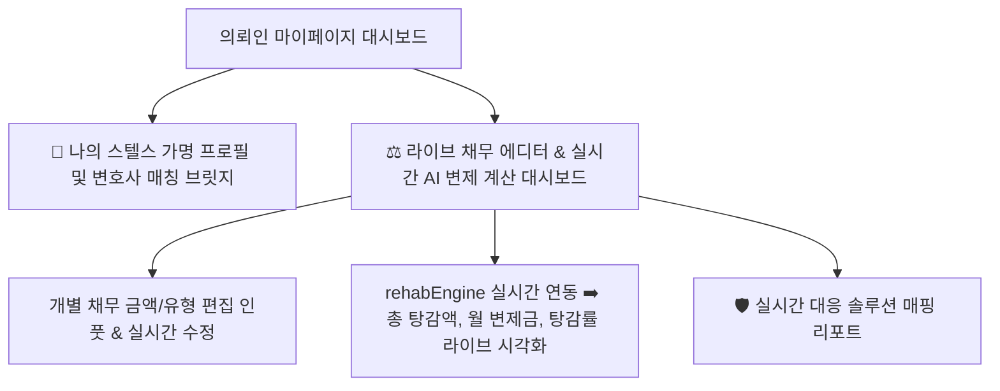

# 🏛️ Rebirthtalk 의뢰인 특화 마이페이지 (My Page) 최종 기획 및 UI/UX 설계안 (v6 - Live Debt Simulator)

본 플랫폼은 수임 전 단계에서 의뢰인에게 가장 신뢰도 높은 **"정밀 채무 자가진단, 법률 솔루션 매칭 및 변호사 1:1 상담 브릿지"**를 제공합니다. 

이번 업그레이드에서는 단순 수동 보고서 수준의 채무 조회를 넘어, **의뢰인이 본인의 개별 채무 현황을 직접 편집 및 업데이트(추가/수정/삭제)하면 플랫폼의 실시간 개인회생 계산 엔진(`rehabEngine.ts`)과 유기적으로 즉각 상호작용하여 "예상 월 변제금", "총 탕감 금액", "원금 탕감률(%)"이 라이브 화면에서 실시간 동적 계산 및 시각화 반영**되는 기능을 핵심적으로 연동합니다.

의뢰인이 플랫폼을 이용하며 본인의 채무를 **주도적으로 통제하고 관리하고 있다는 확실한 해방감과 통제권**을 부여하는 최종 기획서안을 확정합니다.

---

## 📊 1단계: 핵심 기능 기획 (Real-time Interactive Feature)

### ⚖️ 실시간 채무 포트폴리오 & 라이브 변제율 계산기 (Live Debt Editor & Simulator)
* **내 채무 리스트 라이브 편집기**:
  * 의뢰인이 기존 상담 접수 시 입력했던 채무 내역(시중은행 신용대출, 카드사 리볼빙, 대부업 고금리 사채 등)의 액수를 직접 텍스트박스를 통해 자유롭게 수정하거나 새로운 채무를 실시간으로 추가/삭제할 수 있는 간편 에디터 카드.
* **실시간 계산 엔진(`rehabEngine.ts`) 즉각 연동**:
  * 의뢰인이 채무 액수나 연체 단계를 수정하는 즉시, 백그라운드 계산 엔진이 작동하여 아래의 3대 핵심 재정 지표를 **0.1초 내로 라이브 동적 갱신(Recalculate)**합니다.
    1. **총 채무액 (Total Debt)**: 개별 채무금의 실시간 합산액.
    2. **예상 월 변제금 (Monthly Repayment)**: 소득 수준과 부양가족 생계비 정책에 따른 월 납입금 가용 소득.
    3. **최종 탕감 금액 & 원금 탕감률 (Total Savings & Rate %)**: 전체 채무액에서 36개월간 성실 납부할 금액을 뺀 **나머지 감면 면책 총액 및 감면 비중(%)** 시각화.
* **채무별 실시간 대응 법률 솔루션 매핑 (Live Solutions)**:
  * 금액 수정에 맞춰 각 채무별 대응 법적 지침서가 유동적으로 변형되어 맞춤형 조언을 노출합니다. (예: 대부업 채무 증가 시 ➡️ "추심 위협 급증! 채무자대리인 우선 발동 알림 활성화").

#### 💡 의뢰인이 체체감하는 정서적 느낌 (Visual & Emotional UX - "채무 주도권 확보")
* **"막연한 공포에서 주도적인 자산 구조조정(Rebirth)으로"**:
  * 예전에는 빚이 얼마인지 무서워서 들여다보지도 못했다면, 본 기능을 통해서는 숫자를 직접 수정해보며 **"아, 내가 빚을 이렇게 기입하고 최적화하면 매달 갚을 돈이 이렇게 줄어들고 이만큼이나 탕감받을 수 있구나!"**라는 재기(Rebirth)의 희망을 눈으로 직접 목격합니다.
  * 채무의 무서운 압박감에 끌려다니던 주도권이 **의뢰인 본인의 손끝으로 넘어와 적극적으로 부채 리스크를 핸들링하고 있다는 극적인 성취감과 주도적인 안도감**을 선물합니다.

---

## 🎨 2단계: UI/UX 레이아웃 설계안 (Layout Blueprint)

마이페이지 화면은 의뢰인의 눈길을 사로잡고 조작이 극도로 용이한 **"라이브 채무 에디터 캔버스 + 실시간 스텔스 방패 솔루션"** 구조로 레이아웃을 최적화합니다.



### 📱 마이페이지 모의 인터페이스 와이어프레임 (Mock Interface)

```text
+-------------------------------------------------------------------+
|  👤 새출발_777 님 마이페이지 (실시간 채무 주도 제어 작동 중 🟢)             |
+-------------------------------------------------------------------+
|  [🚨 전담 배정 변호사단]                                            |
|   - 이소민 변호사 (서울/경기 도산 전문 변호사)                          |
|   [ 💬 1:1 비공개 상담 채팅방 즉시 입장하기 ]                         |
+-------------------------------------------------------------------+
|  [📊 실시간 AI 변제 진단 결과 대시보드]                               |
|   - 실시간 총 채무액: [ 6,700만 원 ] (수정 반영)                      |
|   - 예상 월 변제금:   [ 월 38만 원 ] (부양가족 1인 생계비 제외 가용 소득)   |
|   - 예상 총 탕감액:   [ ★ 5,332만 원 탕감 ] (원금의 79.5% 전격 면책!)       |
+-------------------------------------------------------------------+
|  [⚖️ 스마트 채무 진단 및 실시간 조절 인풋 폼]                           |
|                                                                   |
|   ■ 신한은행 신용대출: [ 3,500 ] 만 원 ✎ [🛡️ 급여 가압류 방어 솔루션]      |
|     *안심방안: 주거래 계좌를 대출 없는 제3금융권(카카오)으로 변경 안내      |
|                                                                   |
|   ■ 신한카드 리볼빙:   [ 1,200 ] 만 원 ✎ [🛡️ 이자 면제 및 회생 통합 대상]   |
|     *안심방안: 카드 결제를 중단하고 개인회생 신청서에 채권으로 포함         |
|                                                                   |
|   ■ 대부업체 사채:     [ 2,000 ] 만 원 ✎ [🛡️ 채무자대리인 추심 차단 완료]   |
|     *안심방안: 대리인 변호사 선임 완료되어 직접 전화/방문 추심 전면 차단   |
|                                                                   |
|   [ + 신규 채무 추가하기 ]                                         |
+-------------------------------------------------------------------+
```

---

## 🛠️ 3단계: 구현 테크스택 제안 (Tech Stack)

1. **실시간 상태 연동**:
   - `ClientRole.tsx` 내의 채무 금액 상태들(`debtBanks`, `debtCards`, `debtPersonals`, `recentLoans`, `coinCrypto`)을 마이페이지 에디터 인풋과 양방향 바인딩(`onChange`).
   - 인풋 변경 시 마다 `calculateRehabPlan` 함수를 즉시 호출하여 `totalDebt`, `monthlyRepayment`, `totalSavings`, `savingsRate` 상태를 React State로 실시간 반응형 변경 렌더링.
2. **Supabase Realtime Update**:
   - 채무 정보가 수정 완료된 후 변호사 채팅이나 룸에 자동으로 변경 사항을 동기화하여 변호사 CRM에도 실시간 갱신 데이터 전송.
